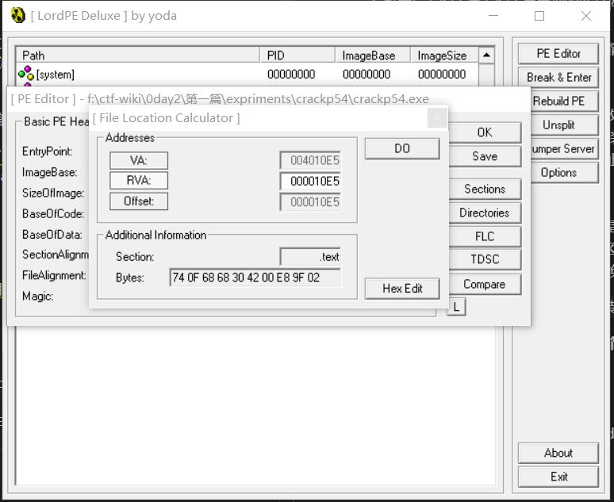
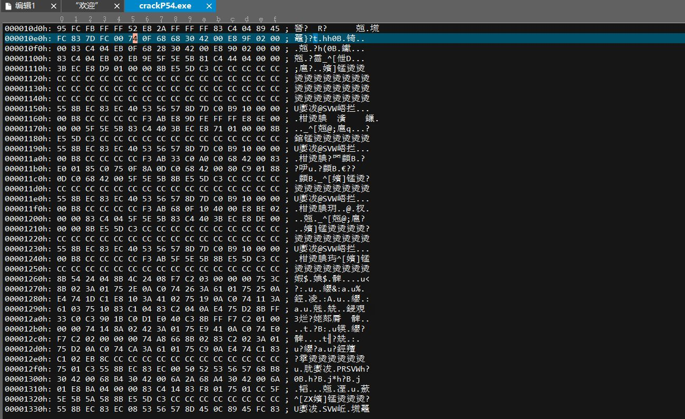
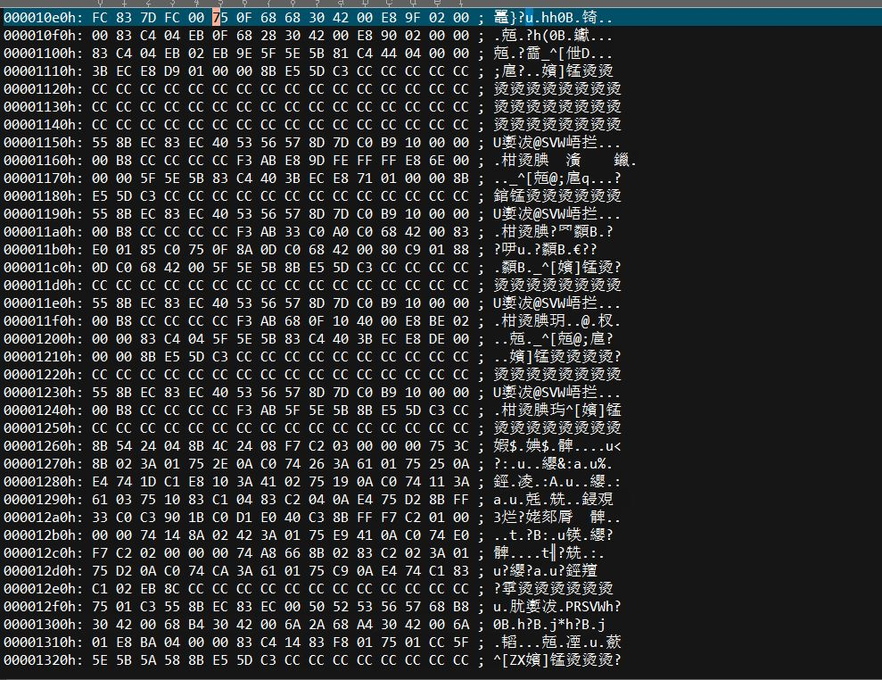

# Notes for chapter one 
## 一些概念from 1.2：
1. 静态反汇编工具汇编工具看到的PE文件中的地址都是文件偏移（文件地址），这个是文件在磁盘上存放的相对于文件开头的偏移。
2. 装载基址：PE装载时的基地址，默认情况下（32位）：
    1. exe的装载基址：0x00400000
    2. dll的装载基址：0x10000000  
    3. 上述的基址可以通过编译选项改变
3. 虚拟内存地址（VA）：PE文件指令被装入内存后的地址（IDA之类显示的地址）。
4. 相对虚拟地址（RVA）：虚拟内存地址相对于装载基址的偏移。RVA，VA，基址存在以下的计算：
    * VA=RVA+Image Base
5. RVA和文件地址有很大的一致性，但是由于装载以后和一般存放在磁盘上内存的存放单位不同，会有差异。（P34 0x200和0x1000的区别）
6. 文件偏移地址与虚拟内存地址之间的换算关系可以用下面的公式来计算：
>文件偏移地址 = 虚拟内存地址（VA）−装载基址（Image Base）−节偏移
= RVA -节偏移

**上述的RVA->文件地址的计算可以用lordPE简化过程**

## from 1.3
1. ring3级别的调试（用户级）使用Ollydbg，ring0的是用SoftICE。

## from 1.4
### 小实验笔记：
我的电脑中的关键跳转语句IDA中的呈现：  
> .text:004010E5                 jz      short loc_4010F6  

即跳转指令的VA在0x004010E5的地方，所以RVA：0x000010E5，使用LordPE的Cul功能得到文件地址：0x000010E5：  

所以这个关键跳转语句在PE文件中位于距离文件开始处10E5字节的地方。
使用UltraEdit进行修改：
将这里的74（je）改成75（jne）：

运行后发现输入错误密码也是正确的提示了：

至此crack小程序实验完成。