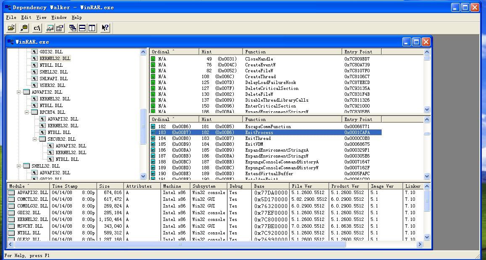

# notes for chapter3
## from 3.2
### 问题描述：
我们再之前的学习中使用的覆盖返回地址的方法不适用与普适情况，如当PE程序被重新加载时，栈桢可能发生移位的情况，这个时候我们得buff区的地址就需要重新计算。  

### 解决方案：
一个函数返回时，esp正好指向原理存储返回地址的下一位，我们将shellcode从ret_addr的后一个位置开始填充，并将ret_addr填充为一个进程中的"jmp esp"的指令的地址，这样函数返回后就会跳到esp指向的栈顶的位置开始执行shellcode。

## 3.2.3 experiment
使用程序找出进程中的user32.dll中的jmp esp的指令的地址：

这里使用0x77d8625f这个地址构造exp（到底使用哪一个其实需要测试一下，我第一次测试不对，第二次使用该地址就可以了）。  
然后根据实验需求，我们需要在弹窗结束后正常退出，即在最后加上这么一段：
```
mov eax,exit_addr
call eax
```
所以我找到ExitProcess这个函数的虚拟地址：

所以这里的退出进程的虚拟地址为0x7C800000+0x0001CAFA=0x7C81CAFA。

这里需要使用的其他地址：  
1. MessageBoxA：0x77D507EA

这里我使用AsmToe直接转换shellcode为机器码：


填充到password.txt中：

测试成功且正常退出：


## from 3.3
缓冲区组成方式，现阶段已经讲了两种：
1. 将shellcode放到缓冲区，然后覆盖返回地址到缓冲区的起始地址。这种适用于缓冲区较大的场合。
2. 将shellcode放到函数返回地址以后，然后覆盖返回地址为"jmp esp"之类的指令，使得函数返回时跳转到shellcode处执行指令。这种适用于缓冲区较小的场合。

使用的《0day2(已加密)》存在错误，P108中的，介绍缓冲区较小，shellcode快将其填满（即shellcode的最后几个字节快到栈底）时，可能会在出现shellcode被破环情况。这里几个“栈顶”改为“栈底”。

P109中记录一些常用的跳板指令的十六进制机器码，要使用时使用前面提到的searchInDLL程序找user32.dll中的指令对应的地址即可。

## from 3.4
通用shellcode开发。
