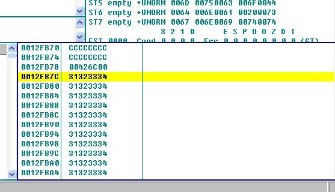
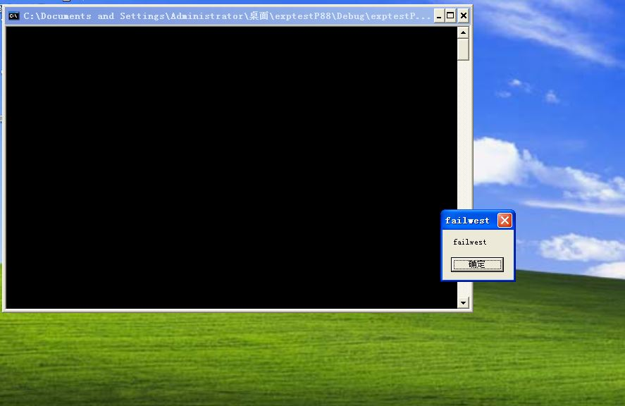

# notes about chapter 2
## from 2.1
1. 每一个C++类成员都有一个this指针，在win中，这个指针一般使用ecx进行保存：


## 2.2.1 expriment
这里的auth标志位在buffer的下方：
>int authenticated;  
char buffer[8];// add local buffto be overflowed

利用思路：  
覆盖掉标志位。
这里的内存布局输入7777777如下:
```
buff[8]    71717171     qqqq
           00717171     NULLqqq
auth       00 00 00 01   真实存储为：   01 00 00 00 00
```
我们想要的:
```
buff[8]    71717171     qqqq
           00717171     NULLqqq
auth       00 00 00 00   真实存储为：   00 00 00 00 00
```
由于字符串末尾有NULL(00)作为结尾，所以我们输入8位的char型即可：
```
buff[8]     71717171       qqqq
            71717171       qqqq
auth        00000000       00 00 00 00
```
即我们想要得到的是00 00 00 00(这个为0，数值数据)，使用NULL将其覆盖即可。  

## 2.3.2 experiment
首先查看我们想要的返回地址：

返回地址为：0x0040112F
使用Ultraedit进行修改覆盖地址的位置即可，从(8+4+4)=16的地方开始覆盖地址：

运行即可：


## 2.2.4 expriment（代码植入）
输入11组4321后的栈桢空间内容：  
  
所以buffer的起始虚拟地址为0x0012FB7C。  
接下来寻找user32.dll的base地址：

可以看到，user32.dll的基地址为：0x77D10000，MessageBoxA的偏移为0x000407EA。所以MessageBoxA的虚拟地址为0x77D507EA。  
然后是调用messagebox的汇编代码以及对应的机器码：
```
xor ebx,ebx
push ebx
push 74736577
push 6C696166
mov eax,esp
push ebx
push eax
push eax
push ebx
mov eax,0x77D507EA
call eax
```
机器码整理如下：

我们将上述的整理填入password.txt中，然后运行测试程序：
 
最后几个疑惑，留待以后解决：
1. 本来使用win10做实验，使用dependencies计算user32.dll以及MessageboxA的相对偏移，buff区也调试出地址，可是最后运行程序总是会卡死，Ollydbg调试几番也未解决。 
2. 这里的机器码的得出我本来是在win10下用汇编工具得出的，但是运行不对，也就是如同1中情况，使用书本给的机器码在winxp中实验后实验成功。

至此第一篇第二章学习完毕。


