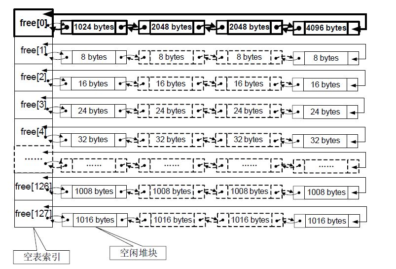
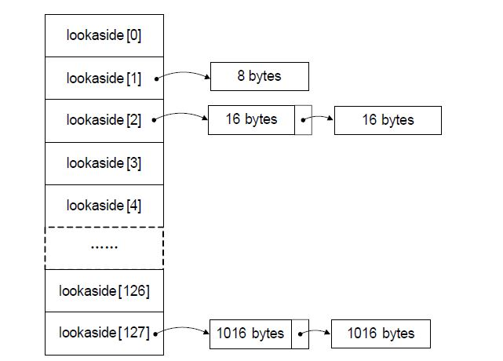
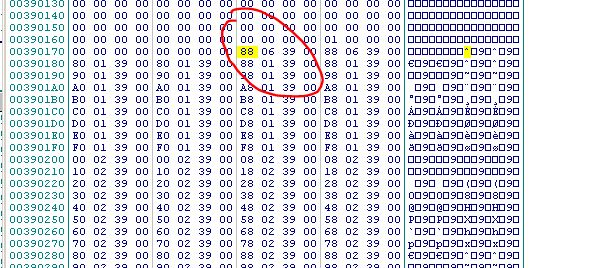
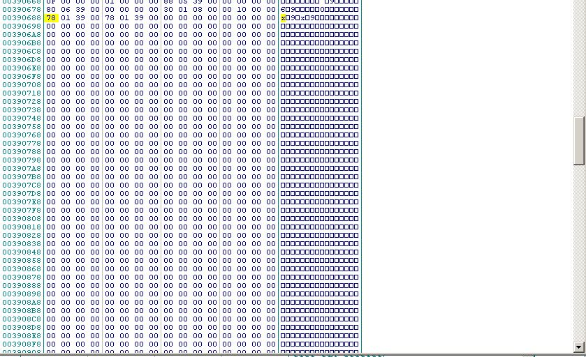
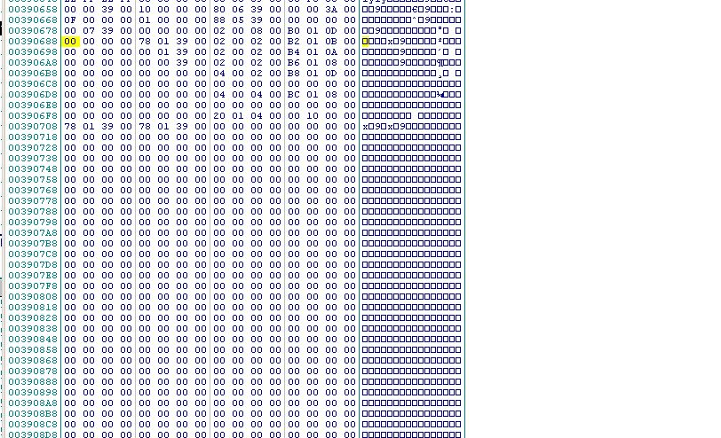
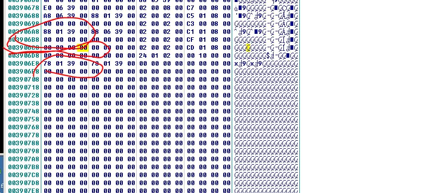
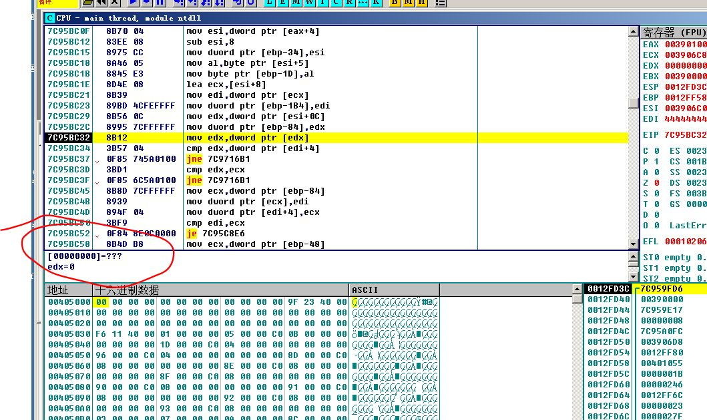

# notes about chapter 5
## from 5.1
堆的一些特征：
1. 堆是一种在程序运行时动态分配的内存。动态内存即是程序设计时不能预先决定的，需要在程序时用户给出。
2. 堆在使用时由程序员用专用的函数进行申请，如：malloc，new等。对内存有可能申请成功，也可能失败。
3. 一般用一个指针来使用申请得到的内存。
4. 使用完毕后，需要把堆指针传给堆释放函数回收这片内存，不然就会导致内存泄漏。释放函数如：free，delete等。

现代操作系统处于一些基本的要求，将堆数据结构分为堆块以及堆表：
1. **堆块**：堆块分为两个部分：块首和块身。块首是一个堆块头部的几个字节，用来标识这个堆块自身的信息，如块的大小，本块的空闲情况；块身是紧跟在块首后面的部分，也是最终分配给用户使用的数据区。
2. **堆表**：堆表位于堆区的起始位置，用于索引堆区中所有的堆块的重要信息，包括堆块的的位置，堆块的大小，空闲还是占用等。堆表的数据结构在设计时可能会考虑平衡二叉树等高级数据结构用于快速查找，现代操作系统的堆表往往不止一种数据结构。

内存的分布大致如下：

Windows中，占用态的堆块被使用其的程序索引，堆表只索引空闲态的堆表。最重要的堆表有两种：
1. 空闲双向链表Freelist（空表）。  
2. 快速单向链表Lookaside（快表）。

### 空表
空表的分布情况：
  

按照堆块的大小，空表被分成有128条。  
空闲堆块的大小=索引项*8  
把空闲堆块按照大小的不同链入不同的空表，可以方便堆管理系统高效检索指定大小的空闲堆块。需要注意的是，空表索引的第一项（free[0]）所标识的空表相对比较特殊。这条双向链表链入了所有大于等于1024 字节的堆块（小于512KB）。这些堆块按照各自的大小在零号空表中升序地依次排列下去。

### 快表
  

堆块的大小=索引项*8    
快表不会发送堆块合并，空闲块的块首被设置为占用态，用来防止堆块合并。  
快表总是被初始化为空，而且每条快表最多只有 4 个结点。

### 堆块分配
1. 快表分配：从快表中找到大小匹配的空闲堆块，将其设置为占用态，将其从堆表中链出，返回一个指向堆块块身的指针给程序使用。
2. 普通空表分配：首先寻找最优的空闲块分配，若失败，则寻找次优的空闲块分配，即最小的能够满足要求的空闲块。
3. 零号空表分配：在零号空表中逆序寻找块（在free[0]中反向查找最后一个块），若满足需求则正向搜索能够满足需求的空闲堆块进行分配。（若最大都不满足就肯定没有满足的了）

堆块分配中的“找零钱”现象：在空表中若无法找到匹配的“最优”堆块，一个稍大的块被用于分配，即从大块中按请求大小精确的割出一块进行分配，然后给剩下的部分重新标注块首，链入空表。而块表由于只在精确匹配时分配，所以不存在上述现象。

### 堆块释放
将堆块状态改为空闲，链入相应的堆表。所有的释放块都链入堆表的末尾，分配的时候也先从堆表末尾拿。  
这里强调了一下：快表最多只有4项。

### 堆块合并
当堆管理系统发现两个空闲堆块彼此相邻时，就会进行堆块合并操作：将两个块从空闲链表链出，合并堆块，调整合并后的大块的块首，将新块重新链入空闲链表。

具体的堆块的分配以及释放，根据内存大小的不同，Windows采取的策略也不同。内存按照大小分为三类：
* 小块：SIZE<1KB
* 大块：1KB<SIZE<512KB
* 巨块：SIZE>512KB

不同的堆块对应上述的不同的堆分配和释放方式：     

堆类型|分配|释放
-----|------|------
小块|首先进行快表分配；若快表分配失败，进行普通空表分配；若普通空表分配失败尝试堆缓存分配；若堆缓存分配失败，进行零号空表分配；若零号空表分配失败，进行内存紧缩后再尝试分配；若仍然无法分配，返回NULL。|优先链入快表；若快表满，将其链入空表。
大块|首先进行堆缓存进行分配；若分配失败，使用零号空表分配。|优先链入堆缓存；若堆缓存满，链入零号空表。
巨块|用到虚分配（不是从堆区分配，本书不涉及）|直接释放，无链入操作。

**几个核心**：  

1. 快表中的空闲快被设置为占用态，不会发送堆块合并。  
2. 快表只有精确匹配才会分配，不存在搜索“次优解”以及“找零钱”现象。
3. 快表是单链表，操作比双链表简单，插入以及删除都很少用到很多指令。
4. 分配以及释放使优先使用块表，失败时才使用空表。
5. 快表有4项，容易被填满。

本节概念性的内容居多。

## from 5.2

所有的堆分配函数最终都是使用位于ntdll.dll的RtlAllocateHeap()函数进行分配。

占用态快的样子：(self_size(2bytes)+previouschunk_size(2bytes)+segment_index(1bytes)+flags(1bytes)+unused_bytes(1bytes)+tag_index(1bytes))(块首部)+data    
空闲态块的样子：(self_size(2bytes)+previouschunk_size(2bytes)+segment_index(1bytes)+flags(1bytes)+unused_bytes(1bytes)+tag_index(1bytes)+flink(4bytes)+blink(4bytes))(块首部)+data

一些其余的细节：

1. 堆块的大小包括了块首在内，若请求32字节，实际会分配40字节：8字节块首+32字节块身
2. 堆块单位为8字节，不足8字节的部分按8字节分配
3. 初始时不存在精确分配，所以将使用“次优块”分配，这个次优块就是尾快。
4. 次优块分配发生后，调整尾块块首信息，并将freelist[0]指向新的快尾。（即两处修改，这里主要修改的尾块块首里的大小信息，以及将freelist[0]指向的地址后移）

### exp 空表分配

空表位于偏移堆区的0x178处：
  

可以看到除了第一个双字节字节的（8bytes）双向指针指向了一个堆块，别的双向指针都指向了自身，即这些空闲链表为空，第一个即Freelist[0]指向了堆中唯一的一个块，即尾块。  
定位到偏移0x688的地方看尾堆：  

这里的堆块其实从0x680的偏移处就开始了，不过链表会自动跳过8字节的块首。这个块的大小通过块首可以看到：0x130。  
六次分配以后，这些分配的块都是从尾块的开头不停地截取出来的。此时偏移0x688的状态：  

 

可以看到块首信息的大小即为分配实际分配的大小（字节）/4字节=堆单位。  
此时尾块大小为：0x130-0x2*4+0x4*2=0x120。  

当三次堆块释放掉以后，被释放的堆块就会被链入空表：

  

此时，0x00390688指向h1释放后的块，0x003906A8指向h3释放后的块，0x003906C8指向h5释放后的空闲块。  
再释放h4后，此时h3,4,5就是相邻的空闲块，发生堆块合并：

  

合并后的堆大小：0x2+0x2+0x4=0x8  

合并后的空闲堆的空表节点：freelist[8]

### exp 快表分配
使用快表时，尾块会往后偏移，原先存放初始尾块的地方存放的是空表（偏移0x688）,此时查看空表的freelist[0]，可以看到尾块偏移变成了0x1E90：

  

此时的偏移0x680的地方存放的是空表。  

将创建的堆块释放以后（这里有个疑惑，链入块表的表从哪里切割下来的，这里调试发现不是尾块）。  
可以看到链入快表的堆块是处于占用态的防止空闲块的合并：  

  

## from 5.3
### dword shoot
dword shoot攻击核心就是覆盖空闲块的8字节的指向后一个块和前一个块的指针。这样就可以实现任意地址填充，将伪造的flink填充到blink指向的地址。

原理：
>在堆块的使用的时候，即将块从空闲态变成占用态，将块的节点从块表中卸下时大致发生的函数：  
int remove (ListNode * node)  
{  
    node -> blink -> flink = node -> flink;  
    node -> flink -> blink = node -> blink;  
    return 0;  
}  

### exp from P191（dword shoot）
三次释放以后的堆块状态：
  
h1,h2,h3,h4,h5,h6状态如下：  

index|addr|size(8bytes)|flag|flink|blink
----|------|-------|-----|--------|------
h1|0x00390680|2|空闲|0x003906A8|0x00390188
h2|0x00390690|2|占用|————|————
h3|0x003906A0|2|空闲|0x003906C8|0x00390688
h4|0x003906B0|2|占用|————|————
h5|0x003906C0|2|空闲|0x00380188|0x003906A8
h6|0x003906D0|2|占用|————|————  

几个说明：
1. 这里的flink虽然叫前向指针但是指向的是下一个空闲堆块+8的地址，blink虽然叫后向指针但是指向前一个空闲堆块的地址+8的地址，这应该与其是双向链表有关。
2. 最后一个空闲块（h5）的下一个空闲块即使最开始的空闲块（双向链表）。

此时在分配一次8bytes的块，就会将最后一个空闲块链出，并将其前后空闲块的flink，blink变动：

  

回到分配堆块之前，将h5的flink和blink进行改动造成dword shoot： 

  

此时再分配就会造成：  

h5->blink->flink=h5->flink  
即将h5flink的值写入blink地址指向的地方，即向0x00000000指向的地方写入0x44444444。  

  

显然这里0x00000000不会指向啥，所以就出错了。  

## from 5.4

### 一些常见的可以利用dword shoot攻击的地方（常见目标）

1. 内存变量。将某个变量的地址写入flink。
2. 代码逻辑。
3. 函数返回地址。覆盖返回地址。
4. 攻击异常处理机制。
5. 函数指针。
6. PEB中线程同步函数。

5.5需要win2000环境，在本地的win2003环境无法做实验，待后续再说。

至此第5章学习完毕。