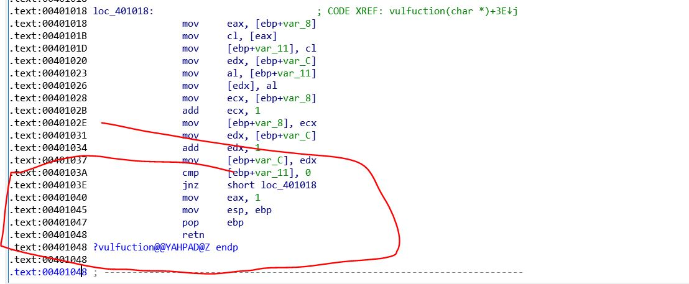
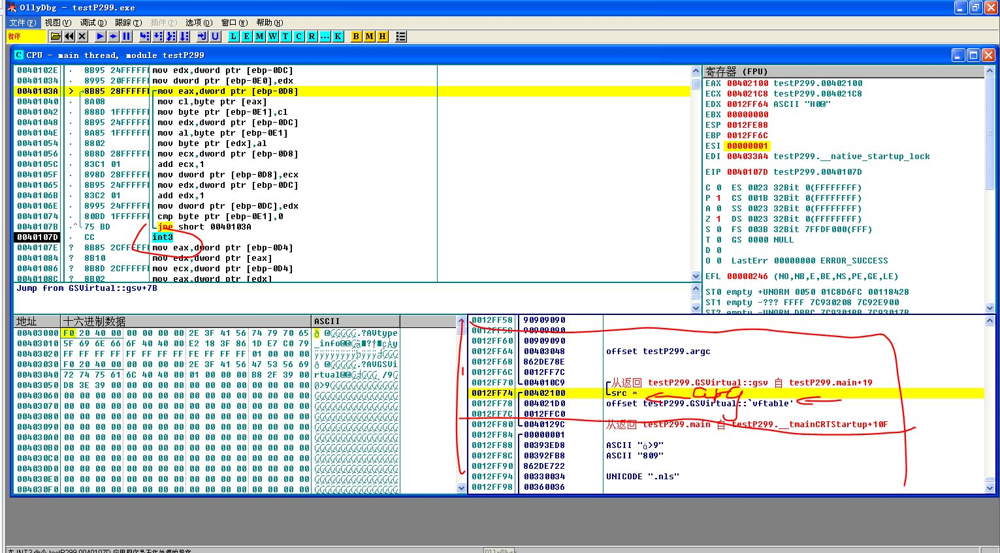
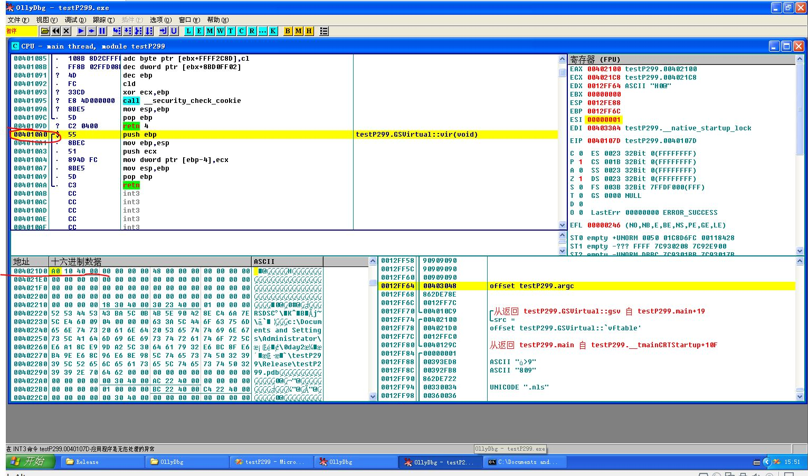

# notes about chapter 10

>第九章：概述
## from 10.1

>以下情况不会应用GS。  
（1）函数不包含缓冲区。  
（2）函数被定义为具有变量参数列表。  
（3）函数使用无保护的关键字标记。  
（4）函数在第一个语句中包含内嵌汇编代码。  
（5）缓冲区不是8字节类型且大小不大于4 个字节。  

## from 10.2
缓冲区不是8字节类型且大小不大于4个字节时该函数不会应用GS：

发生了溢出：

## from 10.3
使用199个"\x90"和一个"\0"作为参数传给buff参数，在strcpy结束后设置一个断点：  

此时gsv的栈桢是这样的，紧接着的是一些参数（4个字节）以及：canary（0x862DE78E），前一个栈桢的EBP（0x0012FF7C），返回地址（0x004010C9），参数（0x00402100），虚表指针（0x004021D0）。所以buff区还差5*4=20个字节。

此时的virtual表的函数为：

