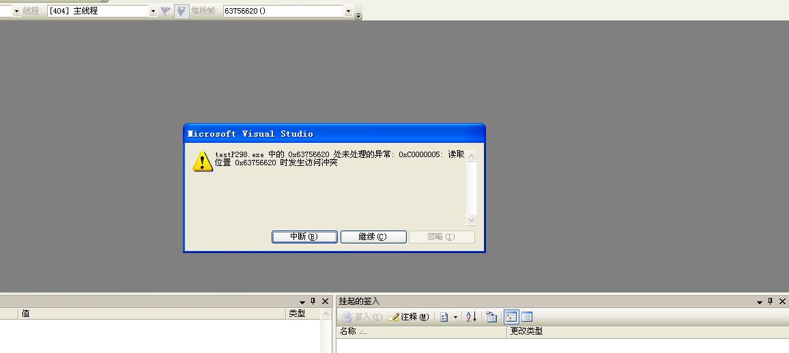
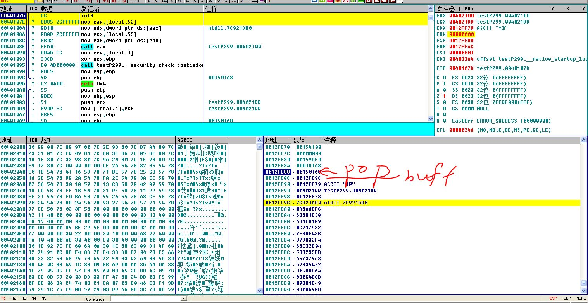
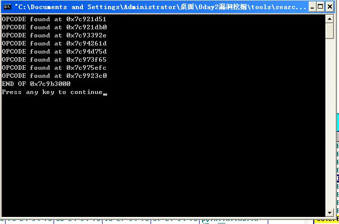
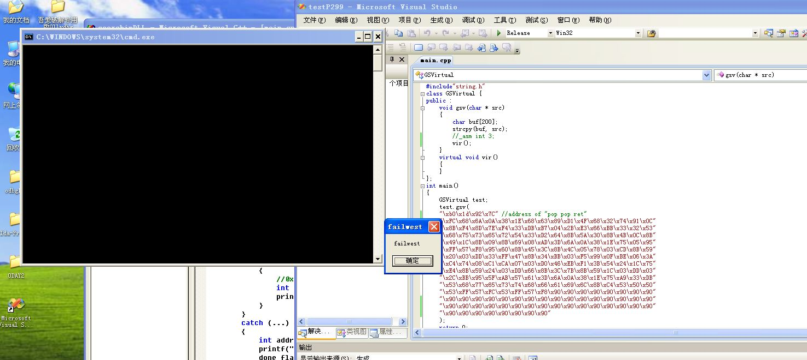
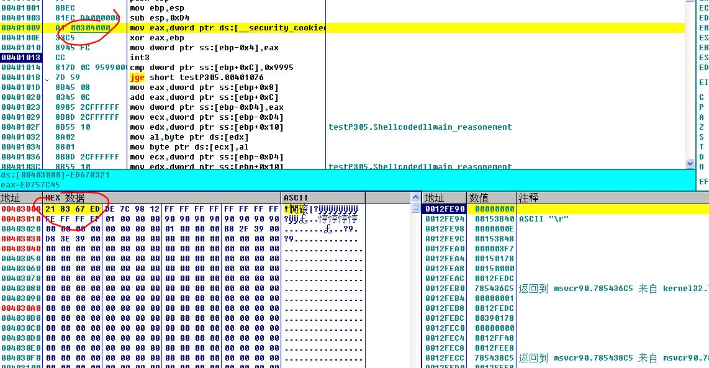

# notes about chapter 10

>第九章：概述
## from 10.1

>以下情况不会应用GS。  
（1）函数不包含缓冲区。  
（2）函数被定义为具有变量参数列表。  
（3）函数使用无保护的关键字标记。  
（4）函数在第一个语句中包含内嵌汇编代码。  
（5）缓冲区不是8字节类型且大小不大于4 个字节。  

## from 10.2
缓冲区不是8字节类型且大小不大于4个字节时该函数不会应用GS：


发生了溢出：



## from 10.3
使用199个"\x90"和一个"\0"作为参数传给buff参数，在strcpy结束后设置一个断点：  


此时gsv的栈桢是这样的，紧接着的是一些参数（4个字节）以及：canary（0x862DE78E），前一个栈桢的EBP（0x0012FF7C），返回地址（0x004010C9），参数（0x00402100），虚表指针（0x004021D0）。所以buff区还差5*4=20个字节。

此时的virtual表的函数为：


继续覆盖20个字节的\x90，就可以看到虚表指针的最后一个字节已经被结束符"\0"覆盖掉了，指向了缓冲区的起始地址（0x00402100）。


之后我们要做的就是使得call eax之后，会执行shellcode。这里初始的思路就是将虚函数指针指向的shellcode起始地址写成0x00402104，这样就会在执行虚函数时执行地址之后的shellcode。尝试之后不行，因为在call的结束之后会有ret操作。所以的操作实际应该是针对栈内的一段shellcode，也就是buff参数。要跳转到对应的shellcode的思路就是：在call完毕，ret指令后，返回到shellcode的地址即可。这里就是：
```
pop
pop
ret
```
即可，第一个将call压入的eip弹出，第二个pop将原先栈顶的弹出，ret后将buff的起始地址弹出给了eip：



这里有个需要说明的：当从buff开始执行的时候，buff起始的地址（也就是pop pop ret指令的地址）当作指令执行时不会有异常发生，所以可以继续顺序执行。

使用前面的searchdll来找到gadgets：



这里测试时0x7c921db0是可以用的。

测试结果：



## from 10.5

这里malloc的起始地址为：0x004020A4


cookie的地址为:0x00403000



这里有一个问题，只能正向的的进行覆盖，因为malloc的地址比cookie在内存中存放的位置的地址小，所以不能突破前面的if的判断进行覆盖。

大致说一下利用思路，将.data中存放Cookie的值覆盖成随机的四个字节（如"\x90\x90\x90\x90"），然后在进行ROP的时候，将ebp-4的地方的值覆盖成"\x90\x90\x90\x90"亦或当前ebp的结果既可以绕过GS机制。

