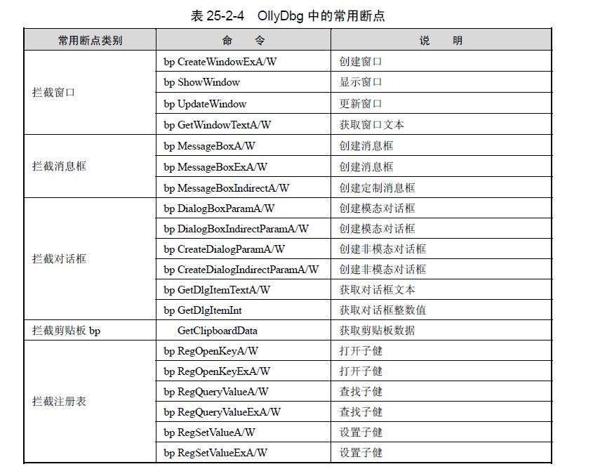
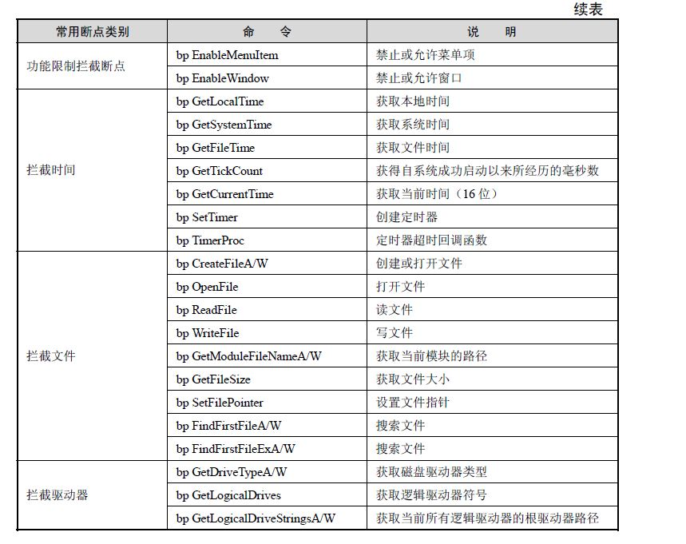

# notes about chapter 25
## from 25.2

### 下断点的技巧

#### 畸形RetAddr断点

所谓畸形 RetAddr断点，就是将POC中溢出后覆盖的函数返回地址修改为一个非法地址（例如 0xFFFFFFFF），在调试POC时能够触发一个非法内存访问的错误，使得调试器中断下来。

#### 条件断点

条件断点是一个带有条件表达式的普通INT3 断点。当调试器遇到这类断点时，它将计算表达式的值，如果结果非零或者表达式无效，将暂停被调试程序。

od中在地址shfit f2即可。

举例：

调试记事本时，UNICODE [[ESP+4]]=="c:\\test.txt"，表示当进入CreateFileW 函数后，如果第一个参数lpFileName为unicode 字符串"c:\\test.txt"时则暂停被调试的程序。

#### 消息断点

消息断点是调试UI程序时的常用技巧。有时需要分析类似一个按钮被单击后程序的处理过程，就需要设置消息断点。消息断点其实是属于条件断点的，只不过是用消息来做表达式的。

#### 内存断点

调试过程更关心的是一些重要数据在内存中的读取、访问等操作，那就需要内存断点的支持了。

“Memory, on access”是内存访问断点，即只要程序读取或运行到此处，就会被暂停；  
“Memory，on write”是内存写入断点，即只要程序写入此处就会被暂停。

#### 硬件断点

硬件断点是使用了4个调试寄存器（DR0，DR1，DR2，DR3）来设定地址，以及DR7设定状态，DR4和DR5是保留的。

#### 常用断点

在使用OllyDbg调试程序时，有些断点是非常常用的，例如某些创建窗口的断点，文件操
作的断点，注册表操作的断点，等等。

