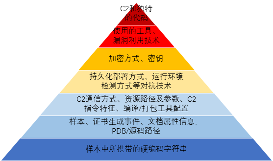

# APT分析及TTPs提取

> 转自[project #](https://projectsharp.org/2020/02/23/APT%20%E5%88%86%E6%9E%90%E5%8F%8A%20TTPs%20%E6%8F%90%E5%8F%96/)，写的很不错，做个笔记（抄一下加深印象）。

## 攻击事件

这里专指网络空间安全领域的攻击事件，即在**未经授权情况下**对计算机系统或计算机资源进行访问、使用、更改、破坏的活动。 根据事件的烈度以及影响范围，可分为以下几类：

1. 常规攻击；

常规攻击一般呈线性，时间复杂度低，杂音少，可直接推出攻击目的。如：非定向钓鱼，端口，服务扫描，SQL注入，拒绝服务攻击，会话劫持，中间人攻击，凭证重放等。这类事件影响小，危害可控且可在短时间内排查修复。

2. Botnet;

僵尸网络特点是大规模攻击，并且涉及到RAT。如：Neucurs，Gafgyt，Mirai，僵尸网络上的垃圾邮件，Ddos等。

3. 恶意软件；

恶意软件一般指勒索，挖矿以及病毒木马。涉及钱包，矿池；目的不同，且包含RAT；不同的入口，也会出现标志性的工具和利用。如：WannaCry，Bad Rabbit，大量MiktoTik路由器被感染进行恶意挖矿等。

4. APT

APT攻击时间复杂度高，多个行为，多个身份，使用的软件有loader，Downloader，RAT，Malware等。知名APT组织：海莲花，摩诃草，APT28，Lazarus Group等。APT的目标通常是监视网络活动并窃取数据，而不是破坏网络或系统。

### 攻击事件的核心元素

首先是很经典的钻石模型：


钻石模型最简表述：**攻击者借助基础设施针对受害者部署能力**。

钻石模型中，每个攻击事件都包含四个核心元素：攻击者（Adversary），受害者（Victim），能力（Infrastructure），基础设施（Capability）。

* 攻击者：攻击事件的直接执行者。

在一些大型的攻击事件中，攻击组织有完善的人员体系结构，这里所说的攻击者，是事件的直接操作者。

* 受害者：攻击者的目标。

不同类型的的攻击事件中受害者表现也不同，可能是一台主机、一个企业或者一个机构。

* 能力：使用的工具或者技术。

能力是事件中攻击者所使用技术或者工具。从探查到最终目的达到，“技术”存在攻击过程的每一个阶段。

* 基础设施：攻击者维持权限控制的通道或者载体。

基础设施可以理解为攻击的C2（Command&Control）通道，可以分为三类：

1. 攻击者购买拥有；
2. 攻击者攻陷的；
3. 使用的第三方平台或者服务；

每个攻击事件都是围绕这四者展开的，而在这四者之上，又可以衍生出“技术”，“社会”维度，指导安全分析。文章中不对钻石模型多做使用。

## APT

APT（Advanced Persistent Threat），翻译为高级持续威胁。文章中的APT，限定在国家及组织对抗的APT攻击场景。

### APT的攻击特点

国家及组织对抗的APT有如下几个特点：

1. 攻击目的性强，为了达到目的不择手段；
2. 雄厚的支持；
3. 目标价值高；
4. 时间复杂度高；

### APT入侵的方式

APT攻击入侵的方式主要有：鱼叉式钓鱼、IM、水坑攻击、钓鱼网站、1/N day漏洞、0 day漏洞和物理接触。入侵包括载荷投递和突破防御两个阶段，各种入侵方式的成本如下图：


入侵金字塔，从下到上，入侵成本和危害程度逐层递增。

* 鱼叉式钓鱼邮件和即时通讯软件：最常见，入侵成本最低的攻击方式。攻击者常以鱼叉邮件作为攻击入口，精心构造邮件标题、正文和附件用来投递恶意网址、伪装文件或者含有漏洞exp的文档。IM与鱼叉邮件钓鱼类似。

* 水坑攻击和钓鱼网站：侵入网站，存放恶意JS；或者使用推特，facebook，论坛等通过发布、评论、转发等方式进行社交平台的水坑攻击。也可以制作钓鱼网站，通过邮件、IM、水坑等方式投递给受害者，窃取账号密码、收集主机信息或者诱惑下载恶意软件。这两种入侵方式的成本也不高。

* 防御边界的渗透攻击：针对的是受害系统、业务的防御边界，进行常规的渗透攻击，如常见的SQL注入，文件上传，XSS，CSRF等。跨站请求伪造等。此类入侵方式较常规网络攻击并无不同，入侵的目的是突破防御边界，找到稳定且隐蔽的入口，渗透攻击在APT攻击中也是比较常见的。

* 漏洞利用：漏洞利用的目的有两点：未授权安装、运行代码和规避杀软检测。其中，0 day漏洞危害和成本要远大于1/N day漏洞。各种APT攻击中，出现过许多操作系统漏洞、路由器或交换机网络设备漏洞，以及office，Flash，PDF等应用漏洞。此种攻击往往搭配其他手法，组合进行入侵。例如容器漏洞在渗透攻击中的利用，以及Office漏洞在钓鱼中的利用（如海莲花常使用的利用合法WPS可执行程序加载恶意DLL）。

* 供应链攻击：在突破上游供应商后，在极短的时间内进行资产摸排、更改、下发、劫持。又同时可以顺利筛选、控制下游目标。典型的例子如 XSHELL 、CCleaner、华硕软件更新劫持等攻击事件。

* 物理接触：较少，典型的事件如“震网”，间谍实地投放病毒。

APT攻击是否成功，取决于**攻击者的目的**和**所具有的入侵能力**，与**目标防御强弱**无关。防御强弱和目标的价值决定了**入侵的方式**。漏洞利用，特别是0 day漏洞都是针对高价值，特定目标，考虑到入侵成本，APT攻击更倾向于其他的入侵方式。

## APT事件分析

在事件分析的初期，我们拿到的线索是破碎零散的，这些线索只是攻击者为了达成目的采取的手段，我们做安全分析，其实是对攻击手段上下文的描述。

事件有四个核心元素，攻击者、受害者、基础设施和能力。我们分析APT，可以从受害者、基础设施和能力三个角度进行切入。具体方法分为两种（针对受害者的作者在下文中提及）:

1. 通过攻击者“能力”切入分析;
2. 通过攻击者“基础设施”切入分析;

### APT事件分析的两种方式

#### 通过攻击者“能力”切入分析

基于能力的分析，对应的是样本分析。样本分析要关注样本的行为以及上下文关系。

样本行为包括样本的恶意行为、驻留、子进程创建、释放文件、网络请求等。其中要注意样本中携带的信息和加解密技术、攻击技术、对抗技术方面的特征。这些携带的信息和特征有助于关联匹配到其他样本。

入侵过程中往往有fake (Downloader)，有 Dropper，有 backdoor；各个阶段还会包含伪装、漏洞利用。初期拿到的样本通常只是其中一个。样本分析是事件分析的基础，只有弄清样本的上下文关系，才能理顺攻击手段。

样本分析通常以恶意软件为起点，针对技术（加解密、攻击技术、对抗技术），C2结构和恶意软件上下文进行分析。根据恶意软件的特征匹配其他样本，扩大分析面。

样本分析期望分析得到的结果：

1. 受害者信息；
2. 基础设施列表；
3. 使用的技术；
4. 样本的一些特征；
5. 匹配到的其他样本；

各大厂商的APT报告都是以攻击者能力切入的，所以看到的大量篇幅都是恶意软件技术报告。

#### 通过攻击者“基础设施”切入分析 

基于基础设施的分析方法是C2关联分析，是描述事件上下文最有效的方法。

样本中多少会暴露一些基础设施信息；或是IP，或是域名。通过WHOIS信息来发现统一注册者的不同域名。进一步研究可以得到针对不同攻击者的恶意软件信息（相似/相同的基础设施）。

C2关联期望分析得到的结果：

1. 与该基础设施有联系的受害者；
2. 该基础设施下发\上传、命令控制等行为；
3. 关联到的其他基础设施；

分析过程中要注意一点，样本分析和关联分析并不是独立进行的。

对恶意软件进行分析，得到其中的C2基础设施。通过对C2的关联分析，找到了同一基础设施下发的其他样本，之后再对样本进行分析，由此形成了一个循环。

如：拿到样本A，对其进行**样本分析**，得到其C2基础设施：域名A和域名B，对C2基础设施进行**C2关联分析**发现具有相同基础设施的样本B。通过对样本B的**样本分析**进一步得到C2域名C。该循环越多，找到的线索就越多，最后事件分析的完整度就越高。

### IoC层级

IoC（Indicators of Compromise）在取证领域被定义为计算机安全性被破坏的证据。在APT领域作用就是描述攻击者得恶意活动。分析人员对IoC进行识别和关联，来寻找恶意活动背后得事件和潜在得威胁。APT分析工作都是围绕IoC进行的。

IoC类型：

1. hash；

指样本文件的哈希值。通常用于提供对特定恶意软件样本或涉及入侵的文件的唯一标识。hash值是分析人员最容易拿到的IoC，但是哈希值很容易改变，文件中更改一个字节，都会影响文件哈希。很多情况下不值得跟踪。

2. IP；

绝大多数恶意软件都有网络行为，其中一定会涉及IP，但是如果攻击者使用匿名代理或者Tor，IP十分容易改变。

3. 域名；

域名和IP类似，但是域名需要注册，要付出一定的费用。因为DNS解析需要时间，即使使用DNS服务商提供的免费域名服务，但是还会有时间成本。所以，域名稍比IP稳定一点。

4. 网络/主机特征；

指C2上，比较有区分度的特征以及恶意样本中，携带的攻击者主机的一些特征。

5. 工具；

APT攻击中，为了达到某种目的，攻击者往往会使用、研发、定制一些工具。比如APT 28使用的
DealersChoice、Xagent。攻击者定制、自研一些工具，肯定要花费一定的成本。如果对攻击套件进行准确识别，攻击者只能放弃目前所使用的工具，这样无疑加大了下次攻击的成本。

6. TTPs；

Tactics，Techniques，and Procedures（战术、技术、过程）。是对攻击者攻击行为，战略战术层次的描述。IP/域名可以更改，网络主机特征也容易消除、工具可以重新开发。但是攻击的战略战术往往很难改变，如果能识别出TTP特征，攻击者要么放弃攻击，要么指定新的战术。这对攻击者将是致命的打击。

IoC金字塔：


IoC金字塔中，由下到上获取难度一次增高，攻击者改变难度和价值也是增高的。

## TTPs提取

TTP: Tactics, Techniques, and Procedures（战术、技术、过程）。

* 战术：攻击者从信息收集开始到目的达成的攻击策略。攻击的目标、攻击目的、前期信息收集方式、对目标攻击的入口点、载荷投递方式等等都可以划分在战术指标里面。
* 技术：为了达成攻击目的，Actor 通常在具体事件中使用各种技术。这些技术旨在突破防御，维护 C2，横向移动，获得信息、数据等。
* 过程：要进行成功的攻击，仅仅拥有良好的战术和技术是不够的。还需要一组精心策划的战术动作来执行才可以。

### 提取难点

战术、技术、过程三个词过于抽象，目前没有很好的方案对TTP进行实体描述。

作者根据钻石分析模型以及Kill chian讨论出一种描述TTP的方法：特征矩阵和事件链图。

### 特征矩阵

特征矩阵是对特征的事件分析过程中，攻击者能力，基础设施，战略等方面的特征总述。

整体分为三个部分，基础设施特征、技术特征、战略特征。

1. 基础设施特征中包含C2列表、网络特征和样本中携带的主机特征；
2. 技术特征包含加解密技术、攻击技术和对抗技术；
3. 战略特征包含目标群体、攻击入口和载荷投递；

如图所示：


>从基础设施以及能力角度进行考虑，加上TTPs的战略/技术。

* 战略/战术：包含目标群体、攻击入口和载荷投递方式和释放流程。攻击入口、载荷投递方式和释放流程可以在样本分析中进行总结。

事件四个核心元素，攻击者、受害者、能力、基础设施。上文提及的通过能力和基础设施切入进行事件分析。此外，还可以通过受害者进行切入分析，得到攻击者的一些战略信息。例如，攻击者为了提高成功率，会贴合受害者定制一些攻击邮件或者文件，通过其中精心构造的邮件名、正文、附件内容，可以反推受害者群体，以此揣摩攻击者的战略目的。

* 基础设施：基础设施分为 C2、网络特征、主机特征。因为会有基础设施重用的情况，C2 列表一定要有；再者就是URL的网络特征以及样本中携带的主机特征。主机特征有很多，例如样本生成的开发/打包工具语言、配置，PDB 调试文件路径、源码路径可以看出攻击者的一些习惯；样本、签名证书的生成时间推断攻击者所在地区、如果数据量大的话，还能根据节假日、休息日推断所在国家。如果有文档类样本，还会有文档所有者、修改者这些攻击者个人信息。

* 技术：技术特征分为加解密、攻击技术、对抗技术、C2技术。技术特征太多了，加密算法、使用的工具、持续部署的方案、漏洞利用、C2 通信方式、反杀软、行为隐藏。。。。。。工具使用，代码重用这些情况都可能导致技术上的重叠。

特征分析方法对应如下：

* 战略技术->受害者分析
* 基础设施->样本分析+关联分析
* 技术特征->样本分析

上述的特征矩阵在能力和基础设施上体现的较多，而战术流程表现的较弱，为了弥补这一点，推出事件链图来表示攻击事件的上下文，体现战术特征。

### 事件链图

几个有关事件链图的前置概念。

#### KILL CHAIN

入侵的本质：攻击者开发有效的载荷突破防御，在可信赖的环境中实现驻留，以便接下来的行动。这种行动可能是横向移动、窃密、破坏完整性或可用性等。

Kill Chain入侵分析模型由洛克希德马丁公司提出，通过对入侵的理解，杀伤链将攻击定义为7个阶段：

1. Reconnaissance(侦察)
2. Weaponization(武器构建)
3. Delivery(载荷投递)
4. Exploitation(漏洞利用)
5. Installation(驻留)
6. C2(命令控制)
7. Actions on Objectives(采取行动)

前面的六个阶段都是为最后采取行动做铺垫。当入侵成功实现驻留之后，恶意软件将会通过C2命令执行一些横向移动、窃密、破坏、勒索等一些恶意行为。

#### 攻击总是线性的

攻击者不可能隔空，也不可能不借助外有资源和能力达成攻击目的。

例子：

```
攻击者投递含有 cve-2017-11882 的钓鱼邮件，受害者打开了钓鱼文件，漏洞利用成功，文档从远程拉取执行了后门。
```

分离：

```
outlook     ->
Explorer    ->
office      ->
EQNEDT32    ->
[NET]       ->
Explorer    ->
Payload
```

**攻击在观测空间内的动作一定是呈线性关系的。操作的对象、攻击的动作一定是有明确的目的和明显的前后关系。**

#### APT 分析单位

事件为APT分析的最小单位，而不是样本。

样本分析 ∈ 事件分析

事件分析 ∈ 攻击战术分析

因为在杀伤链模型中，邮件钓鱼、钓鱼网站、恶意软件有各不相同入侵过程。虽然整个攻击是连贯的，还是要将各个步骤拆解出来，单独进行事件分析。

>事件链图即是将一次完整的攻击事件拆分为相关联的事件，每个事件都是以KILL CHAIN进行表述。

为了表述事件链图。指定以下场景：

APT 组织对某机构进行攻击：
攻击者通过google hacking搜寻到所属该单位的某雇员，通过社交平台找到其163邮箱。
对该员工发送钓鱼邮件，其中包含163邮箱钓鱼网站。
雇员查看钓鱼网站，泄漏了自己163邮箱密码。
攻击者登陆邮箱，查看往来信件，锁定高价值目标。
向高价值目标发送钓鱼邮件，其中包含有漏洞利用的文档。
文档被打开，主机被感染，窃取到机密文件

该例子的事件链图：


入侵的上下文用实线连接，事件之间的上下文用虚线连接。就构成了基于杀伤链的事件链图。

>这里的话，按照作者意思，事件链图每个事件中的KILL CHAIN中前6个不需要都有，但是第七个(攻击成功或者进一步行动)必须存在。

## TTPs使用及其归因判断

* 特征矩阵

特征矩阵着重对APT活动技术上面进行描述。

两个活动A和B，将特征矩阵由A到B进行映射，相同颜色部分标识相同特征。区域的颜色标识特征的置信度。当置信度达到一定阈值后。我们就可以将两个活动关联起来，认为是同一攻击组织所为。


不同的IoC的更改难易程度不同，所以各种IoC的价值也不同。

作者参照Pyramid of Pain制作了Pyramid of Features：



金字塔上的特征有下到上，特征的改变难度越高、价值越高，使得在分析时，权重和置信度也越高。

如果特征上，置信度叠加不高，就可以在事件链图中进行匹配：


A是所掌握的某组织的事件链图，B是独立攻击的事件链图。

红色部分为匹配到的相同特征，如果特征置信度达不到一定阈值。可以观察A攻击的上下文，与所掌握B的信息是否相符。如果上下文重合度高。可以增加B∈A的可能性。

TTP是有生命周期的。APT攻击在对抗中升级，技术、战术特征会在一段时间后变的面目全非。

归因判断不仅仅可以通过特征矩阵进行特征匹配，还可以通过事件链图攻击上下文进行佐证。

## 落地思考

>我倒是没啥思考，先实现个事件链图玩玩了。

转自[project # author:PI4net](https://projectsharp.org/2020/02/23/APT%20%E5%88%86%E6%9E%90%E5%8F%8A%20TTPs%20%E6%8F%90%E5%8F%96/)